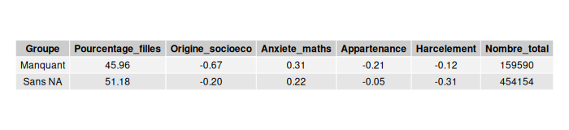
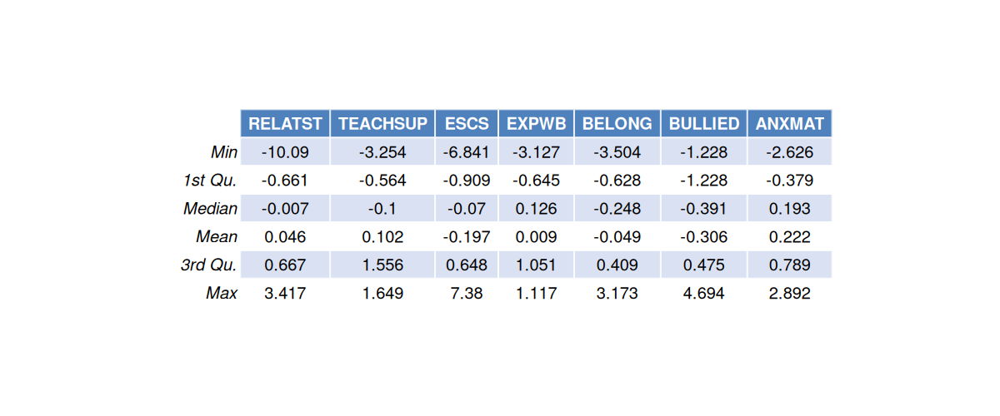

\renewcommand{\contentsname}{Table des matières}

# Introduction

"La relation élève-enseignant s'intéresse à ce qui se passe entre l'enseignant et ses élèves, à l'école, d'un point de vue à la fois cognitif, affectif et social, au-delà des savoirs scolaires" (Espinosa, 2016). Selon lui, l'enseignement constitue un facteur à part entière de l'éducation des élèves, car même si cette dernière relève majoritairement de la responsabilité des parents, l'impact des professeurs dans la vie des élèves reste non négligeable. C’est pourquoi à première vue, l’école semble être le lieu de l’apprentissage des connaissances via la transmission d’un savoir par un professeur à des élèves. Cependant, l’effet de l’enseignement pourrait ne pas se limiter uniquement aux résultats scolaires comme on pourrait le penser a priori. Ainsi, cette relation nous amène à soulever quelques interrogations. Peut-on tout d’abord établir un réel lien entre la réussite scolaire et la qualité des interactions entre les élèves et leurs enseignants ? De plus, comme l’évoque Espinosa, une bonne REE a-t-elle des répercussions positives sur une dimension plus sociale ou bien mentale comme le bien-être par exemple ? Tout ceci mène à nous intéresser au sujet suivant : La relation entre élèves et enseignants (REE).

La relation élèves enseignants caractérise une interaction, qu'elle soit positive ou négative, entretenue entre les élèves et les enseignants. Cette relation s'inscrit dans une dynamique de transmission des savoirs et peut être qualifiée de verticale, dans la mesure où l'enseignant détient un savoir que l'élève est en train d'acquérir. Elle possède également une dimension subjective, puisqu'elle repose en grande partie sur le ressenti des élèves. Ainsi sa mesure repose nécessairement sur des données déclaratives, susceptibles de comporter certains biais.

Dans notre étude nous allons donc mesurer cette REE, et nous nous demanderons si une bonne relation entre élèves et enseignants influence positivement la scolarité des élèves à différentes échelles.

Dans un premier temps, il s’agira de comprendre ce qu’est la relation élèves-enseignants à travers la manière dont elle est perçue par les élèves, ainsi que d’analyser les cas de non-réponse. Ensuite, nous étudierons les liens entre la REE et la réussite scolaire, en tenant compte des performances individuelles, des différences entre pays et du contexte socio-économique. Enfin, nous nous intéresserons aux relations entre la REE et le bien-être des élèves dans le cadre scolaire, notamment en termes d’anxiété et de relations entre pairs que ce soit à l’échelle des pays, du sexe ou encore de la dimension socio-économique.

# 1 Comprendre la relation élève-enseignant

## 1.1 Cadre d'analyse de la REE
En premier lieu, afin de définir le cadre dans lequel nous nous plaçons, il faut avant tout préciser comment se caractérisent élèves et enseignants dans le questionnaire PISA. En effet, pour un élève, il s'agit ici d'un enfant âgé d'environ 15 ans inscrit dans un établissement scolaire public, privé ou bien spécialisé et pouvant provenir de 85 pays différents pour l'édition 2022. Par ailleurs, les enseignants sont, par définition, les professeurs des élèves interrogés dans l'enquête PISA.

Ainsi, nous nous plaçons dans un contexte particulier d'analyse puisqu'il faut dans notre cas, étudier la REE grâce aux données présentes sur les questionnaire PISA 2022. Cette base de données permet d'accéder à des informations portant sur les performances scolaires, le contexte socio-économique des élèves, leur ressenti vis-à-vis de l'école ainsi que leur relation avec leurs enseignants. C'est pourquoi, afin de pouvoir réaliser notre étude, il nous fallait proposer une mesure des différents types de REE sur lesquels nous souhaitons nous appuyer. Ainsi, nous avons utilisé deux indices déjà créés par l'OCDE afin de caractériser cette relation. En particulier, nous avons choisi de travailler avec l'indice mesurant la REE globale, qui comprend des questions générales sur le ressenti de l'élève quant à ses interactions avec leur enseignants, mais également l'indice mesurant la REE ciblée sur les professeurs de mathématiques. Ces indices ont une moyenne de 0 par rapport aux pays de l'OCDE et plus il est positif, plus l'élève affirme avoir une bonne REE/bénéficier d’un soutien de son enseignant de mathématiques.

Toutefois, une potentielle limite de notre analyse mais inhérente au questionnaire PISA, est qu'il ne prend en compte la REE que dans un seul sens. En effet, dans la réalité, les enseignants ont une influence sur leurs élèves mais l'inverse est aussi véridique, les élèves peuvent modifier le comportement de leurs professeurs. Cependant, ce deuxième sens dans la REE ne peut être vérifié dans cette enquête, car seuls les élèves expriment leur opinion sur leurs professeurs.

## 1.2 Les profils des élèves qui ne se positionnent pas sur leur relation avec le corps enseignant
Pour commencer notre analyse, nous allons regarder le profil des élèves qui n'ont pas d'indices REE global ou de REE ciblée sur les professeurs de mathématiques. 

{fig-cap="Tableau 1 : Comparaisons groupes avec valeurs manquantes et sans"}

Note de lecture: Dans le groupe qui n'a pas de valeur en indice de REE global ou de REE ciblée sur les professeurs de mathématiques on a 45.96% de filles. Pour le groupe avec aucune valeur manquante sur ces deux indices on a 51.18% de filles

Ce tableau sépare les données en deux, les "manquant", c'est à dire les élèves n'ayant pas de REE global ou de REE ciblée sur les professeurs de mathématiques, et "Sans NA".

Les manquants représentent 159590 données c'est-à-dire 26% de nos données. A partir de cela nous pouvons faire un premier profil des élèves qui ne se positionnent pas sur leur relation avec le corps enseignant. En premier lieu, le groupe "manquant" comprend plus de garçons que le groupe qui se positionne sur leur relation avec le corps enseignant, et est légèrement plus anxieux en mathématiques.  Trois indices ont une différences plus marquée, le premier montre que le sentimant d'appartenance pour le groupe "manquant" est plus faible que l'autre groupe avec un écart de 0.16 points. L'harcèlement augmente aussi, passant de -0.30 à -0.12 et enfin l'indice sur l'origine socio-économique diminue fortement, passant de -0.20 pour le groupe ayant répondu aux question à -0.67 pour le groupe "manquant". 

Pour faire un résumé nos données manquant ont le profil suivant par rapport aux autres données: On y retrouve plus de garçons, plus anxieux envers les mathématiques, plus harcelé et avec un moins bon sentiment d'appartenance et pour finir une origine socio-écono beaucoup plus faible.

{fig-cap="Comparaison des moyennes générale des élèves en fonction de leur statut de réponse sur le REE global"}

Note de lecture : La distribution de la moyenne générale des élèves n'ayant pas d'indice de REE est plus centrée sur la gauche que la distribution pour les élèves ayant un indice de REE.

En ce qui concerne le graphique ci-dessus, on a une logique concernant le profil des élèves qui ont des non réponses. Nous voyons qu'il existe une relation entre le fait de ne pas avoir d'indice de REE et la moyenne générale. En effet on remarque que la distribution de la moyenne générale des élèves n'ayant pas d'indice de REE est plus centrée sur la gauche que la distribution pour les élèves ayant un indice de REE. On peut donc en conclure que les élèves qui ne se positionnent pas sur leur relation avec le corps enseignant sont des élèves avec une moyenne générale plus faible que ceux se positionnant.

{fig-cap="Comparaison des moyennes en mathématiques des élèves en fonction de leur statut de réponse sur le REE ciblée sur les professeurs de mathématiques"}

Note de lecture : La distribution de la moyenne en mathématiques des élèves n'ayant pas d'indice de REE portant sur les enseignants de mathématiques est plus centrée sur la gauche que la distribution pour les élèves ayant un indice de REE.

Concernant la figure 3, nous avons la distribution des notes en mathématiques selon leur réponses ou non pour avoir un indice de REE centré sur les professeurs de mathématiques. En effet l'utilisation de la moyenne en mathématiques est plus appropriée que la moyenne générale quand on regarde une potentielle liaison entre le professeur de mathématique et l'élève. On en tire les mêmes conclusion que dans la figure 2. Les élèves n'ayant pas répondu aux questions relatives sur la REE avec le professeur de mathématique ont de moins bonne notes que ceux ayant répondu aux question dans cette matière.

Nous pouvons donc ajouter des caractéristiques au profil de nos élèves qui ne se positionnent pas sur leur relation avec le corps enseignant. En effet ce sont des élèves avec des moins bon résultats généraux et en mathématiques. Ce profil montre que nos analyses futures entre la REE et les autres variable pourront être biaisé car on ne s'intéressera qu'aux élèves ayant un indice donc on pourrait observer de moins fortes corrélation entre les notes et la REE car ceux ayant de moins bonnes notes sont ceux n'ayant pas de REE. 

{fig-cap="Statsitiques des différentes variables après suppression des valeurs manquantes"}

Notes de lecture: La variable RELATST correspondant à la qualitée de la REE global possède une moyenne de -0.007, un minimum de -10.09 et un maximum de 3.417.

Notes: RELATST correspond à l'indice sur la REE globale.
TEACHSUP correspond à l'indice sur la REE ciblée en mathématique.
ESCS correspond à l'indice sur la catégorie socio-économique de l'élève.
EXPWB corresopnd à l'indice sur le bien-être de l'élève sur les derniers jours.
BELONG correspond à l'indice sur son sentiment d'appartenance.
BULLIED correspond à l'indice sur le harcèlement.
ANXMAT correspond à l'indice sur l'anxiéyé en mathématiques.

Pour continuer notre analyse nous avons supprimé de notre base de données tous les élèves qui n'ont pas d'indice de REE global et ciblée sur les mathématiques, nous vérifions que cela n'a pas trop modifié les statistiques initiales de notre jeu de données. Selon les indications de l'OCDE, décrite dans la partie 1.1, la moyenne est centrée sur 0 pour les pyas appartenant à l'OCDE et avec un édart-type de 1, donc en ajoutant les autres pays on se retrouve proche de 0 mais pas forcément exactement. En enlevant les données, on retrouve partout une moyenne aux alentours de 0 et avec un premier et troisième quartile entre -1 et 1 ce qui confirme que notre écart-type est toujours proche de 1. Donc le fait d'avoir enlevé les données manquantes n'a pas trop affecté nos variables.

## 1.3 Une relation décrite comme globalement positive au travers du vécu de l'élève.

{fig-cap="Graphique en barre indiquant le taux de réponse positives selon les questions"}

Note de lecture : 85% des élèves affirment que leurs enseignants sont respectueux envers eux.

Il paraît maintenant pertinent de s'intéresser à la qualité de cette relation et savoir comment elle est perçue par les élèves ayant un indice REE. Car un indice relève en effet de la qualité globale de la relation, mais il est aussi important de savoir le détail par question. Pour cela nous avons récupéré le taux des réponses positives par question en ce qui concerne la relation élève-enseignant au global et celle sur les professeurs de mathématiques, seulement pour les élèves ayant répondu à la question. 
On remarque que les résultats sont très positifs, la question ayant le moins bon résultat est "Les enseignants font attention aux élèves en cas de retard", avec 72,7% de réponses positives. Quant aux autres résultats, ils se situent entre 79.4% et 94.2% de réponses positives. On peut conclure que les trois qualités qui caractérisent au mieux cette relation positive sont un enseignant qui n'est pas méchant, qui est amical et qui se soucie du bien-être des élèves.

Cette relation étant très positive en ce qui concerne les enseignants au global, il semble alors juste de rentrer plus dans les détails en s'intéressant aux enseignants de mathématiques précisément. On a sur la figure suivante le taux de réponse positives pour les questions concernant les enseignants de mathématiques. 

{fig-cap="Graphique en barre indiquant le taux de réponse positives selon les questions avec les enseignants de mathématiques"}

Note de lecture : 32.2% des élèves affirment que leur enseignant de mathématiques montre de l'intérêt pour l'apprentissage des élèves.

Les résultats sont très différents de ce qu'on a pu observer avec les enseignants dans leur globalité. En effet, les taux de réponses positives se trouvent seulement entre 25.4% et 32.2%, on se retrouve donc avec une majorité de réponses négatives contrairement à la relation globale. Cela montre donc que la REE avec le professeur de mathématiques est mauvaise en comparaison avec la REE globale.

Ainsi, après avoir décrit la relation élèves-enseignants et la manière dont elle est perçue par les élèves, il convient désormais de s’interroger sur ses effets concrets, notamment en ce qui concerne la réussite scolaire.

# 2 La REE et la réussite scolaire : une relation complexe

## 2.1 Le niveau académique individuel n'explique pas la qualité de la REE

La relation élèves-enseignant peut être étudiée dans le cadre de la réussite scolaire et plus précisemment avec le niveau académique des élèves.
Comme la REE est une relation prenant place au sein des établissements scolaires, il est tout à fait naturel de s'interroger sur l'influence de la REE sur le niveau des élèves et inversement.
Le niveau scolaire est ici étudié au travers des notes établies par l'OCDE lors de l'enquête PISA 2022.
Celles-ci permettent de connaître le niveau relatif des élèves concernant différents domaines d'études : les mathématiques, la compréhension de l'écrit et les sciences.
Pour comprendre au mieux la relation que le niveau scolaire peut entretenir avec la REE, les analyses vont se porter sur la moyenne générale obtenue par les élèves ainsi que leur moyenne de mathématiques.

{fig-cap="Matrice de corrélation entre les variables"}

Note de lecture : La corrélation entre la REE et la moyenne générale est de 0.06.

Ainsi, contrairement à ce que l’on peut penser a priori, le niveau académique des élèves n'explique pas la qualité de la relation avec leurs enseignants.
En effet, le lien de corrélation est presque nul (0.06).
Par conséquent, un élève peut potentiellement bien s’entendre avec son professeur sans pour autant que cela ai une influence sur ses résultats scolaires.

La relation élèves-enseignants en général est corrélée positivement à la relation élèves-enseignants en mathématiques (0.33).
Cette corrélation permet de voir que la REE en mathématiques s'explique en partie par la REE en générale.
C'est pourquoi, dans les analyses suivantes, les deux variables de REE seront étudiées.

De plus, on constate une très forte corrélation entre la moyenne générale et la moyenne en mathématiques (0.99).
Il est possible de passer d'une moyenne à l'autre sans que les résultats en soient altérés.

D’autres facteurs semblent donc être à la source de la réussite scolaire des élèves qu’une bonne relation entre élève et enseignant au niveau global.

## 2.2 Le niveau académique national est corrélée négativement avec la qualité de la REE

Comme on constate qu'il n'y a pas de lien entre REE et notes pour les élèves, il convient d'étudier cette relation à l'échelle des pays.
Dans cette analyse, on utilise la moyenne de REE dans chaque pays et la moyenne des notes obtenues.
Cela permet de comparer les niveau nationaux et donc de comparer les différents systèmes éducatifs et leurs influences sur la REE.

Il existe une corrélation négative moyenne entre la qualité de la REE et la note moyenne de chaque pays (r² =\~ -0,26, p-value =\~ 0.03).
La REE n'explique que partiellement le niveau académique mais d'autres facteurs entre en compte.
On ne peut donc pas conclure d'une relation très forte entre ces deux indicateurs.

En se concentrant sur la REE avec les enseignants de mathématiques, on observe des résultats plus marqués.
La note moyenne utilisée est désormais celle des mathématiques et non plus la moyenne générale, même si les deux moyennes sont interchangeables.

Avec un test de corrélation, on constate que plus un pays dispose d’un niveau en mathématiques élevé, selon les notes de l'OCDE, moins la relation entre les élèves et les enseignants de mathématiques est jugée positive.
En effet, la corrélation est négative (r² =\~ -0.50, p-value =\~ 1.18e-05) entre la qualité de la REE moyenne d'un pays et sa note OCDE moyenne concernant les mathématiques.

{fig-cap="Nuage de points représentant les corrélation entre la note moyenne en mathématiques et la relation avec le professeur de cette matière par pays"}

Note de lecture : Le Kazakhstan a un niveau moyen en mathématiques (445) équivalent à la moyenne des pays interrogés et un indice de REE moyen plus positif qu'en moyenne (0.45).

Note : L'indice REE est une variable composite : une valeur positive indique une perception de la relation plus chaleureuse et soutenante que la moyenne de l'OCDE, tandis qu'une valeur négative indique une relation perçue comme plus distante ou moins aidante.

Certains pays ne semblent pas suivre cette corrélation négative, comme Singapour où la relation avec les enseignants de mathématiques est plus postive d'environ 0.4 point qu'en moyenne dans les pays de l'OCDE.
De plus, le niveau moyen en mathématiques y est le plus élevé.

De son côté, le Guatemala ou le Paraguay confirment bien le lien de corrélation.
Le niveau moyen en mathématiques est largement en dessous de la moyenne, alors qu'on y retrouve la meilleure REE moyenne. Aussi, la répartition des pays correspond en partie au regroupement par continent, ce qui nous permet de dire qu'il y aurait différents types de systèmes éducatifs selon les zones géographiques.

## 2.3 La REE et l'influence du statut socio-économique

Si les notes et la REE sont corrélées, on peut tout de même s'interroger sur l'influence du statut socio-économique des parents dans la relation qu'entretient l'élève avec ses enseignants.
Autrement dit, les origines sociales des élèves modifient-elles la manière dont ils intéragissent avec le corps enseignant ?

### 2.3.1 L'origine sociale des élèves n'explique pas la qualité de la REE

{fig-cap="Boxplots de la valeurs de l'indice de REE global selon l'indice socio_économique"}

Note de lecture : Les 50 % d'élèves situés parmi les 25% les plus défavorisés (quartile 1) rapportent des scores d'indice de REE compris entre environ -0,7 et +0,8.

Note : Les losanges rouges représentent la moyenne arithmétique de chaque groupe, tandis que la ligne noire horizontale à l'intérieur de chaque boîte indique la médiane (50 % des élèves se situent au-dessus, 50 % en dessous).

Le statut socio-économique des parents n'influence pas la qualité de la relation entre élèves et enseignants, comme le montre le graphique ci-dessus.
Le vécu des élèves apparaît comme similaire quelques soient les origines sociales.
Les écarts inter-quartile sont très similaires pour les quatres groupes socio-économiques, tout comme les moyennes et les médianes.

En s'intéressant à la relation élèves-enseignants en mathématiques, les résulats changent légèrement.

{fig-cap="Boxplots représentant la valeur de la REE ciblée sur l'enseignant de mathématique en fonction de la valeur de l'indice socio-économique"}

Note de lecture : L'indice moyen de relation avec l'enseignant de mathématiques pour les élèves appartenant au quart le plus défavorisé de la population (quartile 1) se situe entre -0.3 et 1.5 pour la moitié d'entre eux (dans la "boîte").

Cette dispersion autour de la qualité de la REE moyenne de l'OCDE change lorsqu'on s'intéresse à la relation dans le cadre des mathématiques.
La "boîtes" du premier quartile est plus haute.
Autrement dit, l'écart interquartile est plus important pour les 25% des élèves les plus défavorisés, qui ont un vécu de la REE avec l'enseignant de mathématiques plus hétérogène, allant de -0.3 à 1.5.

### 2.3.2 La qualité de la REE moyenne est corrélée à l'origine sociale au sein de chaque pays

A l'échelle des pays, la REE et le statut socio-économique des élèves sont corrélés négativement de manière significative (r² =\~ -0.41, p-value =\~ 0.0005).
Alors, lorsque dans un pays le statut socio-économique moyen a tendance à être plus défavorisés, les élèves observent en moyenne une meilleure relation avec leurs enseignants.
Inversement, dans les pays avec un statut socio-économique moyen davatange favorisé, la REE est jugée plus négativement.

{fig-cap="Nuage de points représentant les pays en fonction de leur REE moyen et de leur statut socio-économique"}

Note de lecture : L'Albanie a un indice socio-économique moyen inférieur à la moyenne des pays interrogés (-0.75) ainsi qu'un indice de REE moyen supérieur à la moyenne (0.3).

Le grapique illustre les différences de systèmes éducatifs entre les différents pays interrogés.
En effet, si à l'échelle individuelle, on ne constate pas de relation de corrélation significative entre les orgines sociales et la qualité de la REE, en comparant les différents pays, on peut conclure d'une influence.
Cette corrélation négative oppose des systèmes éducatifs tels que ceux du Vietnam ou du Guatemala et celui de la Moldavie.
D'un côté, on retouve des pays dont les élèves ont des origines davantage défavorisées et une REE plutôt positive, de l'autre côté un pays dont les élèves ont un statut scoio-économique correspondant à la moyenne OCDE et une REE jugée plus négativement qu'en moyenne au sein des pays de l'OCDE.

On peut en conclure que si, au niveau individuel, aucune corrélation significative n'est observée, une corrélation modérée à forte apparaît au niveau agrégé, c'est-à-dire au niveau des pays.
Le résultat est comparable à la corrélation entre la qualité de la REE et les notes OCDE.

Cette différence suggère que le lien entre la qualité de la REE et le statut social n'est pas individuel, mais une caractéristique systémique.
Cela révèle le fonctionnement des systèmes éducatifs et leur capacité à créer une relation plus ou moins positive entre les élèves et les enseignants.

::: {.callout-note icon="false"}
### Lien entre le statut socio-économique et le niveau scolaire des élèves

Comme le présentent de nombreuses études, le statut socio-économique des parents est positivement corrélée avec le niveau scolaire.
Il est également possible de parler de lien de causalité entre ces deux éléments

"Le statut socio-économique peut avoir une influence considérable sur les résultats de l'apprentissage. Si les mauvais résultats ne découlent pas automatiquement d'un désavantage socio-économique, les écoles reproduisent parfois les schémas existants d'avantages et de désavantages, au lieu de créer une distribution plus équitable des opportunités d'apprentissage et des résultats pour les élèves." [^1] 

[^1]: [Causalité entre statut socio-économique et résultats scolaire, OCDE](https://www.oecd.org/fr/topics/sub-issues/student-socio-economic-status.html)

Cette relation se confirme avec une Analyse en composantes principales (ACP).

{fig-cap="Cercle de corrélation"}

La dimension 1 s'explique par la qualité des cours de mathématiques et la qualité des relations élèves-enseignants.
Tandis que la dimension 2 s'explique par la moyenne générale et le statut socio-économique, qui figurent comme étant corrélées positivement.

Le lien entre l'origine sociale et le niveau scolaire explique donc la présence de résultats similaires concernant la corrélation entre la qualité de la REE et le niveau académique puis avec le statut socio-économique.
:::

## 2.4 La REE et le rapport aux apprentissages

### 2.4.1 La qualité de la REE est influencée par l'appréciation des cours

Au delà du niveau scolaire ou de statut socio-économique, l'appréciation de l'élève concernant les matières étudiées peut partiellement expliquer la qualité de la REE, notamment concernant la qualité de l'enseignement.

L'appréciation des mathématiques comme étant l'une des matières préférées de l'élève est légérement corrélée avec la qualité de la relation avec l'enseignement de cette matière.
La corrélation a un r² d'environ 0.21 (p-value < 2.2e-16), ce qui permet de dire qu'il y a bel et bien un lien entre ces deux éléments mais celui-ci reste faible.
Alors, aimer les maths ne suffit pas à expliquer une bonne relation entre un élève et son enseignant de mathématiques.

La qualité perçue des cours de mathématiques est davantage corrélée avec la qualité de la relation avec l'enseignant de mathématiques.
En effet, la corrélation est de 0.41 et est significative (p-value < 2.2e-16).
La qualité de la REE en maths est donc dépendante de la qualité observée des cours de mathématiques au cours de l'année.

### 2.4.2 Des pays aux systèmes scolaires similaires en fonction de la qualité de la REE

Lorsqu'on change d'échelle, en regardant la qualité observée moyenne des cours de mathématiques par pays, on constate une importante corrélation positive entre qualité des cours et qualité de la REE (r² =\~ 0.62, p-value = 1.035e-08).
Alors, meilleure est la qualité des cours de mathématique, meilleure est la relation entre les élèves et les enseignants à l'échelle nationale.

{fig-cap="Nuage de points représentant les pays en fonction de leur REE ciblée en mathématiques et la qualité des cours de mathématiques"}

Note de lecture : Le chili suit la relation de corrélation entre la qualité des cours de mathématiques et la qualité de la REE. Son indice de REE moyen est de 0.27 et son score moyen de qualité d'enseignements des mathématiques est de 7.

Avec ce nuage de points, on retrouve la même répartition des différents pays en miroir par rapport aux corrélations avec les notes et le statut socio-économique. On peut alors se demander si il n'y aurait pas des profils de pays selon la qualité de REE. Pour ce faire, nous avons réaliser un regroupement des pays selon leur indice de qualité de la REE, leur note moyenne et la qualité des cours de mathématiques. 

{fig-cap="Regroupement des pays selon la méthode du k-means"}

Note de lecture : D'après le regroupement des pays par la méthode du k-means, en fonction de la qualité de la REE, des notes et de la qualité d'enseignement en mathématiques, l'Australie, le Portugal, la Suède et Singapour ont des modèle éducatifs similaires.

Tableau 2: Tableau des moyennes pour chaque groupe issus du regroupement k-means

| Groupe | Qualité de la REE | Note | Qualité des cours de maths |
|:-----------------|:----------------:|:----------------:|:----------------:|
| 1 | $\textcolor{red}{0.33}$ | $\textcolor{blue}{389}$ | $\textcolor{red}{7.48}$ |
| 2 | $\textcolor{blue}{-0.17}$ | $\textcolor{red}{470}$ | $\textcolor{blue}{6.23}$ |
| 3 | $\textcolor{blue}{0.01}$ | $\textcolor{blue}{402}$ | $\textcolor{red}{6.83}$ |
| 4 | $\textcolor{red}{0.17}$ | $\textcolor{red}{501}$ | $\textcolor{blue}{6.49}$ |
| **Total** | **0.04** | **443** | **6.70** |

Le groupe 1 regroupe des pays ayant en moyenne une meilleure qualité de REE et d'enseignement en mathématiques.
En revanche, ces pays ont des notes bien inférieures à la moyenne, avec une différence de 54 points.
Cette différence représente un peu plus de 2 ans de scolarité en moins pour les élèves de ces pays par rapport à l'ensemble des pays.
Il comprends le Viet Nam, le Pérou ou encore l'Arabie Saoudite.

Le groupe 2, en rouge, est composé de pays ayant une qualité de REE négative en moyenne (-0.17), des notes légèrement au-dessus de la moyenne de l'ensemble des pays interrogés (470 \> 443).
On y retrouve la Grèce, la France ou la Nouvelle-Zélande.

Le groupe 3, en vert, avec des pays comme la Jordanie, la Thailande et leBrésil, a une qualité de REE neutre, des notes plus faibles qu'en moyenne (402) et une qualité d'enseignement en mathématiques légèrement supérieure à la moyenne (6.8).

Le groupe 4, en orange est avant tout caractérisé par les notes moyennes obtenues (501).
Les pays qui le composent ont aussi une qualité de REE légèrement positive (0.17), tandis que la qualité d'enseignement est jugée moins bonne qu'en moyenne (6.49).
La Corée du Sud, Hong Kong, l'Australie ainsi que la Norvège en font partie.

On peut en conclure des profils types de pays. Un pays du groupe 1 semble avoir un système éducatif davatange accès sur la qualité de la REE et de l'enseignement, que sur la performance académique. Pour un pays du groupe 2, la qualité de la REE est généralement négative, pour autant le niveau académique reste légerement supérieur à la moyenne. Concernant le groupe 3, les pays ont tendance à avoir une qualité de REE neutre, correspondant à la moyenne des pays de l'OCDE, ainsi qu'un niveau scolaire relativemenbt faible. La qualité de l'enseignement est certes supérieure à la moyenne mais les pays de ce groupe ne se caractérisent pas par un profil très marqué. Enfin un pays du groupe 4 est avant tout un pays performant où la qualité de la REE est légérement plus positive qu'en moyenne mais où la qualité de l'enseignement est légèrement plus faible.

Pour mieux se rendre compte des regroupements de pays selon leur qualité de REE, notes et qualité d'enseignement, il est pértinent de les représenter sur une carte.

{fig-cap="Carte du regroupement des pays suite au k-means"}

Note de lecture : La majorité des pays d'Europe ont des modèles similaires de REE associés aux notes et à la qualité d'enseignement.

Si certains groupes de pays se caractérisent notamment par leur qualité de REE moyenne (comme le groupe 1 et 2), d'autres groupes s'expliquent davantage par les autres facteurs (qualité d'enseignement des mathématiques ou niveau académique). 
Les regroupements de pays semblent parfois suivre des groupes de pays déjà existants, comme l'Europe du Sud et de l'Est ou l'Amérique latine.

Si on peut regrouper les pays et leur système éducatif en fonction de leur REE et d'autres facteurs, on constate bien que la question de la qualité de la scolarité des élèves dans ces pays va au-delà des notes ou de la qualité d'enseignement. C'est pourquoi, il apparaît nécessaire d'étudier la relation entre la qualité de la REE et le bien-être des élèves.

# 3 Existe-t-il une relation entre la REE et le bien-être des élèves dans le cadre scolaire ?

## 3.1 L’étude de la REE et du bien être sous le prisme de l’individu semble ne pas faire valoir un lien très marqué.

Nous étudierons ainsi dans quelle mesure cette relation d'enseignant à élève peut impacter le bien-être de ces derniers.

Pour estimer le bien-être des élèves des pays de l’OCDE, nous utiliserons entre-autre l’indice de bien-être ressenti durant les jours précédents. Cet indice est construit grâce à la partie du questionnaire sur le bien-être. L’indice s’affiche comme manquant lorsque l’élève n’a pas répondu “Oui” à la question “La journée d’hier était-elle une journée comme les autres ?”

Les indices suivants peuvent être étudiés afin d’élargir l’analyse et de comprendre quels éléments influencent plus particulièrement les REE comme le harcèlement par exemple. D’autres variables et indices peuvent être retenus pour expliquer la REE tels que l’indice d’anxiété concernant les mathématiques ou encore l’indice du sentiment d’appartenance à l’école, un groupe de camarades.

Il est alors loisible d’apporter quelques précisions sur les indices que nous venons d’évoquer. Ainsi, l’indice sur l’anxiété ressentie concernant les cours de mathématiques permet d’approfondir l’analyse de l’indice de soutien de l’enseignant de mathématiques. Il est construit avec les réponses aux questions concernant la crainte des difficultés en cours de mathématiques ou la crainte de l’échec. En revanche, l’indice sur le sentiment d’appartenance, représente le sentiment d’appartenance de l’élève à son école ainsi que l’existence de relations avec d’autres à l’école.  Enfin, l’indice sur le harcèlement repose sur la fréquence de plusieurs signes de harcèlement durant les 12 derniers mois, d’après les élèves.

En outre, pour savoir si ces indices ont un réel impact sur les différents types de REE nous pouvons étudier la matrice des corrélations ci-dessous :

{fig-cap="Matrice de corrélation entre la variable REE et les variables de bien-être"}

Note de lecture : La corrélation entre l'indice d'appartenance et de harcèlement est de -0.26

Note : REE correspond à l'indice de qualité de ma relation élève-enseignant. REE maths est l'indice de qualité de la relation avec l'enseigant de mathématiques. Le bien-être fait référence l'indice de bien-être récent. L'anxiété maths est l'anxiété ressentie concernant les mathématiques. Appartenance correspond au sentiment d'appartenance des élèves et harcèlement est l'indice de harcèlement construit par l'OCDE.

Cette matrice des corrélations nous donne un premier aperçu des différents liens entre nos indices de REE et les variables de bien-être. Aucune corrélation n’est réellement notable mais quelques petits coefficients peuvent être remarqués comme celui entre la REE globale et le sentiment d’appartenance qui est de 0.27, donc une REE globale élevée est susceptible d’améliorer le sentiment d’appartenance de l’élève. Les autres coefficients de corrélation entre les indices de REE et les variables liées au bien-être comme l’anxiété, le sentiment de harcèlement ou bien le niveau général de bonheur se situent tous entre -0.20 et 0.20. On ne peut donc pas apporter une conclusion très marquée sur la relation entre nos variables d'intérêt. 

Nous pouvons donc relever uniquement, que de petits liens existent entre le bien-être et la REE, sous le prisme des élèves pris au cas par cas. Cependant, même si on ne peut tirer d’analyses très concluantes au niveau individuel, il peut être intéressant de changer de dimension et de se placer à l’échelle d’un pays tout entier. Cela pourrait nous permettre de déduire si, les méthodes d’interaction mises en place par les enseignants d’un pays aux yeux de leur élèves, ont un impact global sur le bien-être des élèves du pays concerné.

## 3.2 La segmentation de l’échantillon par pays rend l’analyse plus pertinente afin de rendre compte du lien entre bien-être et REE

Si l’analyse du lien entre les variables de bien-être et les indices de REE ne s’est pas révélée très concluante, il peut être plus pertinent de s’intéresser à ce même lien mais regroupé au sein des pays pris séparément. Dans cette optique, nous pourrions potentiellement relever si, dans certains types de systèmes éducatifs, les élèves sont plus heureux que la moyenne.

Nous mesurons ici le bien-être par un indicateur général, construit à partir des quatres variables caractérisant le bien-être : le sentiment d’appartenance à l’école, le bien-être récent, l’anxiété en mathématiques et l’exposition au harcèlement. Les deux dernières dimensions étant négativement corrélées au bien-être, sont inversées afin d’assurer une interprétation homogène de l’indicateur. Ainsi, un score élevé de bien-être traduit systématiquement une situation plus favorable. En regroupant les individus simplement par pays, lorsque l’on calcule les liens de corrélations en faisant la moyenne de la REE des pays et de leur bien-être, on se retrouve dans la même situation que précédemment puisqu’aucun travail permettant de séparer l’échantillon a été effectué. En effet, on trouve un coefficient de corrélation pratiquement nul : -0.001. 

Le lien entre la REE et le bien–être à l’échelle des pays ne se fait également pas remarquer dans une analyse non-discriminante. Il faut donc trouver un moyen de classifier l’échantillon portant sur un facteur discriminant des pays, d’où tout l’intérêt de notre étude dans cette partie.

Un premier facteur permettant de différencier les pays entre eux est l’appartenance à l’OCDE. En effet, l’OCDE (Organisation de Coopération et de Développement Économiques) est une organisation internationale regroupant principalement des pays dits “développés”. Elle promeut des politiques publiques favorisant le bien-être social et l’amélioration des systèmes éducatifs. C’est pourquoi, utiliser ce statut peut être pertinent dans notre analyse. Ainsi, de manière générale dans le cadre des enquêtes PISA, l’appartenance à l’OCDE s'avère jouer un rôle déterminant pour savoir si un élève inscrit son parcours scolaire dans un environnement propice à sa situation sociale et mentale ou non.

{fig-cap="Nuage de points représentant la REE des élèves en fonction de leur bien-être regroupé par pays et différenciés selon leur appartenance ou non à l'OCDE"}

Note de Lecture: Le Guatemala a une moyenne de bien-être par élève d'environ -0.05 et une REE moyenne par élève de 0.73

On constate donc un lien positif marqué entre le bien-être moyen et la REE moyenne par pays en fonction de l’appartenance à l’OCDE. En effet, pour la plupart des pays de l’OCDE, on remarque que plus la REE moyenne est bonne, plus l’indicateur de bien-être moyen tend aussi à être important, en particulier pour la Corée du Sud (Korea) où la REE semble avoir une importance majeure sur le niveau de bonheur des élèves. En revanche ce lien s’inverse généralement lorsque l’on s’intéresse aux pays ne figurant pas dans l’OCDE notamment pour le Paraguay (PRY) qui voit son indice de bien-être diminuer au fur et à mesure que la REE moyenne augmente.

De plus, ce que la régression linéaire entre la REE et le bien-être en moyenne selon l’appartenance à l’OCDE tend à faire remarquer, se confirme par l’analyse des coefficients de corrélations entre ces deux indicateurs d’intérêt. De ce fait, on distingue a priori, une corrélation positive entre la REE dans l’OCDE et les variables de bien-être (à hauteur d’un coefficient de +0.34), tandis que si un pays n’appartient pas à l’OCDE, le lien REE et bien-être tend à s’inverser et donc devenir négatif (-0.23). A noter, que ces coefficients de corrélation ne se sont pas toujours montrés très significatifs après tests de corrélation de Pearson. En effet, on trouve tout d'abord une p-value de 0.08 (> 5%, le niveau de test) pour le premier test qui n’atteint pas le seuil de significativité statistique, suggérant une tendance mais sans preuve suffisante pour pouvoir affirmer qu'il existe un véritable lien de corrélation entre nos variables d'intérêt. Puis, nous relevons une p-value de 0.28 pour le second (on ne rejette pas l'hypothèse de corrélation nulle à 95% de confiance). Ainsi, plus la REE est bonne dans l’OCDE et plus le niveau de bien-être semnle l'être tout autant. En revanche, il est fortement possible qu'il n'existe pas de lien significatif entre les interactions entre élèves et enseignants et le niveau de bien-être moyen (hors OCDE).

Pour approfondir l’étude du lien entre REE et bien-être au sein de l’OCDE il peut être pertinent de valider ou réfuter nos précédentes analyses en généralisant le caractère discriminant des pays au niveau de développement au sens de l’Indice du Développement Humain (IDH) du Programme des Nations Unies pour le Développement (PNUD). Pour ce faire, nous avons utilisé la classification suivante. Les pays ayant un niveau de développement qualifié de “Élevé” regroupent une partie des membres de l’OCDE et certaines nations où l’IDH est substantiel même si celles-ci n’appartiennent pas à l’OCDE. Les pays émergents ou en période de transition sont inclus dans le niveau de développement “Intermédiaire”. Finalement, les pays dits “en développement” sont inscrits dans la catégorie “Faible". C’est donc sur cette répartition des pays étudiés que nous allons poursuivre notre analyse.

{fig-cap="Nuage de points représentant la REE des élèves en fonction de leur bien-être regroupés par pays et différenciés selon leur niveau de développement"}

Note de lecture : Le Danemark (DNK) figurant dans la liste des pays à niveau de développement dit “Élevé” possède une moyenne de bien-être par élève de 0.10 ainsi qu’une REE moyenne de 0.30.

On peut donc observer sur le nuage de points ci-dessus, que sur la base d'un nouveau critère de classification des pays, les résultats obtenus viennent renforcer l'analyse précédente. En effet, la REE dans les pays à niveaux de développement qualifiés de “Intermédiaire” et “Faible” semble n'avoir pratiquement aucun effet sur le bien-être des élèves de ces pays. Ainsi, nous arrivons à la même conclusion que dans la partie précédente : il n'existe pas ici de corrélation significative entre ces deux indices moyens pour les pays à IDH moins importants ("Intermédiaire" et "Faible"). On s'apperçoit en calculant les nouveau coefficients de corrélation, que ces derniers sont pratiquement nuls (respectivement -0.050 et -0.002, significatifs sous H0 : le véritable coefficient de corrélation est nul). Ceci s'explique en partie par le fait, que certains pays de l'OCDE à IDH plus faibles, se retrouvent "déclassés" au sein de la nouvelle classification et viennent donc "casser la tendance" d'un lien négatif entre REE et bien-être que l'on pouvait a priori observer dans la partie précédente (avant les tests). En revanche, pour les pays à niveau de développement "Élevé" le lien de corrélation reste similaire (0.30). Toutefois, contrairement à l'étude des pays où l'on segmentait sur l'OCDE, on s'aperçoit que ce dernier devient significatif à 95% de confiance (p-value = 0.037 < 0.05). Ceci nous permet alors, de fonder un véritable lien de corrélation positif entre la REE et le bien-être dans les pays à fort niveau de développement. Finalement, nous pouvons affirmer que plus le niveau de développement d'un pays est important plus la REE a un impact conséquent sur le bien-être des élèves, à 95% de confiance.

Ainsi, après nous être intéressés au lien entre REE et bien-être en fonction du niveau de développement des pays, nous allons utiliser un autre moyen de segmenter l’échantillon retenu. En effet, nous pouvons également scinder la population en fonction des caractéristiques relatives aux individus qui la composent et non par rapport au pays d’origine des élèves. Dans la partie suivante, c’est le sexe des élèves qui sera étudié pour compléter notre analyse REE/bien-être.

## 3.3 Le sexe comme variable de différenciation ne modère pas l'effet de la REE sur le bien-être des élèves

Un autre facteur permettant de séparer la population est représentée par le sexe. Ainsi l’objectif est d’identifier d’éventuelles inégalités ou sensibilités spécifiques des élèves selon leur sexe auprès de l'influence des REE sur leur bien-être.

Dans un premier temps, les observations avec une information manquante sur le sexe sont supprimées afin de garantir la comparabilité des groupes. Une variable catégorielle sexe est ensuite créée. Dans notre jeu de données nous avons 232437 filles contre 221685 garçons, cela est donc équilibré.

Ainsi, au niveau des coefficients de corrélation, nous avons généralement relevé que ceux-ci sont plutôt similaires que ce soit pour les garçons ou bien pour les filles. L’impact de la REE sur le bien-être ne diffère pas réellement en fonction du sexe, prise comme seule variable discrimiante de la population. 

Pour pouvoir proposer une analyse plus pertinente en utilisant le sexe comme facteur permettant de segmenter notre échantillon nous pouvons y ajouter l’étude des pays dans lesquels le lien entre le sexe et la REE est plus ou moins important afin de tirer des conclusions sur le niveau de bien-être  observé.

L’objectif de cette analyse est d’examiner si les écarts entre filles et garçons en matière de REE sont associés aux différences de bien-être observées entre les sexes, à l’échelle des pays.

Pour cela nous allons classer les pays en deux groupes selon que leur REE moyenne est plus favorable aux garçons ou aux filles. On calcule ensuite le bien-être moyen pour chacun de ces groupes.

{fig-cap="Graphique en barre représentant le bien-être moyen selon le profil de REE du pays"}

Note de Lecture: Pour les pays ayant une REE moins favorable aux filles, le bien-être moyen est de 0.025

Le graphique laisse apparaître un écart visuel entre les deux groupes, les pays à REE favorable aux filles affichant un bien-être moyen légèrement supérieur. Cet écart doit toutefois être soumis à un test statistique avant d'en tirer des conclusions.
Le t-test de Student permet de déterminer si la différence observée entre deux moyennes est réelle ou due au hasard. La statistique t (t = 1,26) mesure l'écart entre les deux moyennes rapporté à la variabilité des données — une valeur faible indique que les groupes sont peu différents l'un de l'autre. La p-value (p = 0,21) représente la probabilité d'observer un tel écart par simple hasard ; au-delà du seuil conventionnel de 0,05, on ne peut pas conclure à une différence significative. Enfin, l'intervalle de confiance à 95 % [-0,022 ; 0,101] contient 0, ce qui confirme qu'on ne peut exclure que la vraie différence soit nulle. Les moyennes des deux groupes (0,025 vs -0,014) sont presques identiques, ce qui confirme l'ensemble de ces résultats : le profil de REE d'un pays, favorable aux filles ou aux garçons, n'est pas associé à un niveau de bien-être moyen significativement différent.

Pour aller plus loin, on visualise directement la relation entre REE et bien-être pour chaque pays, en distinguant filles et garçons.

{fig-cap="Nuage de points représentant la REE et bien-être par pays selon le sexe"}

Note de lecture: L'Albanie (ALB) a une REE de 0.60 et un bien être de 0.20 chez les femmes.

Le nuage de points révèle que les deux droites de régression sont presques parallèles. Cela signifie que la relation entre REE et bien-être est d'intensité similaire pour les filles et les garçons : lorsque la REE s'améliore dans un pays, le bien-être progresse de manière comparable pour les deux sexes. Le sexe ne modère donc pas la relation entre REE et bien-être à l'échelle des pays. Cependant, on note que les filles présentent souvent un niveau de bien-être inférieur à celui des garçons à niveau de REE équivalent, mais cet écart étant constant quel que soit le niveau de REE, il ne relève pas de la relation enseignant-élève et dépasse le cadre de notre analyse.

L'ensemble des analyses menées dans la partie 3.3 montre un résultat clair : le sexe, pris isolément ou combiné à la dimension pays, ne constitue pas un facteur de différenciation significatif de l'effet de la REE sur le bien-être. Les matrices de corrélation sont similaires entre filles et garçons, le profil de REE des pays n'est pas associé à des différences de bien-être significatives, et les pentes de régression sont identiques pour les deux sexes. 

## 3.4 Le milieu socio-économique comme variable de différenciation ne modère pas non plus l'effet de la REE sur le bien-être des élèves

Pour ce faire, servons-nous de la variable sur l'indice de statut économique, social et culturel (ESCS). C'est un indicateur qui mesure le milieu socio-économique des élèves à partir du niveau d'éducation et de la profession des parents ainsi que des ressources du foyer (comme les livres ou l'accès à un ordinateur).
L'indice est découpé en quatre quartiles afin de distinguer les élèves selon leur milieu social : les 25 % les plus défavorisés (Q1), deux groupes intermédiaires (Q2, Q3), et les 25 % les plus favorisés (Q4).

À l’échelle individuelle, l’analyse des corrélations selon les différents niveaux de statut socio-économique ne met pas en évidence de différences structurelles marquées entre les variables étudiées. Les relations entre bien-être, REE et autres variables associées restent globalement similaires quel que soit le niveau d’ESCS.
Autrement dit, le fait de comparer les individus selon leur statut socio-économique ne permet pas de faire apparaître des variations significatives dans les liens entre ces variables. Les mécanismes semblent donc relativement stables au niveau individuel.
Dans la continuité de l’analyse menée sur le sexe, l’étape suivante consiste alors à passer à une lecture agrégée au niveau des pays. Cette approche permet d’examiner si des différences plus structurelles émergent lorsqu’on observe les écarts entre groupes plutôt qu’entre individus.

Pour cette étape, nous reprenons exactement la même construction méthodologique. L’indicateur de bien-être est défini de manière identique, à partir des mêmes quatre variables centrées (sentiment d’appartenance à l’école, bien-être récent, anxiété en mathématiques et exposition au harcèlement), les deux dernières étant inversées afin d’assurer une lecture cohérente de l’ensemble.
Comme précédemment, les données sont ensuite agrégées au niveau des pays afin de disposer d’indicateurs moyens comparables entre contextes nationaux. Cette harmonisation permet de conserver une logique d’analyse similaire à celle utilisée pour les différences de sexe.

Contrairement à l'analyse par sexe qui ne comportait que deux groupes naturels, la variable ESCS en compte quatre. Conserver les quatre quartiles dans le t-test et le nuage de points présenterait deux inconvénients majeurs : d'une part, les groupes intermédiaires (Q2 et Q3) introduisent du bruit sans apporter de contraste analytique supplémentaire ; d'autre part, le nuage de points deviendrait illisible avec quatre points par pays soit plus de 300 observations. On choisit donc de ne retenir que Q1 et Q4, qui représentent les situations les plus contrastées et permettent une comparaison directe entre élèves très défavorisés et très favorisés, dans le même esprit que la comparaison filles/garçons menée en 3.3.

Les pays sont classés en deux groupes selon que leur REE est plus favorable aux élèves favorisés (Q4) ou défavorisés (Q1). On calcule ensuite le bien-être moyen pour chacun de ces groupes.

{fig-cap="Graphique en barre représentant le bien-être moyen selon le profil de REE du pays"}

Note de lecture: Pour les pays ayant une meilleur REE chez les élève provenant de catégories socio-économiques défavorisées, le bien-être moyen est de 0.03.

Le graphique laisse apparaître un léger écart entre les deux groupes de pays. Le t-test permet de déterminer si cet écart est statistiquement significatif. Les résultats obtenus via le t.test ne permet pas de conclure à une différence significative (t = 1,13 ; p = 0,26). L'intervalle de confiance à 95 % contient 0 [-0,017 ; 0,064], et les moyennes des deux groupes sont très proches (0,029 vs 0,006). Ce résultat est cohérent avec celui obtenu pour le sexe : le simple fait de classer les pays selon leur profil de REE, ici favorable aux défavorisés ou aux favorisés, n'est pas associé à un niveau de bien-être moyen significativement différent.

{fig-cap="Nuage de points représentant la REE et bien-être par pays selon la catégorie ESCS"}

Note de lecture: L'Albanie (ALB) possède une REE moyenne de 0.45 et un bien-être moyen de 0.3 chez les élèves venant d'un milieu socio-économique défavorisé.

Le nuage de points met en évidence deux enseignements principaux. D'une part, les deux droites de régression sont presques parallèles, ce qui signifie que la REE a un effet d'intensité similaire sur le bien-être pour les élèves défavorisés et favorisés : lorsque la relation avec les enseignants s'améliore dans un pays, le bien-être progresse de façon comparable dans les deux groupes. Le milieu social ne modère donc pas la relation entre REE et bien-être à l'échelle des pays.
D'autre part, les élèves du quartile supérieur (Q4) affichent un bien-être plus élevé que ceux du quartile inférieur (Q1), à niveau de REE équivalent. Ce décalage vertical, visible aussi dans la partie 3.3, traduit un effet du milieu social sur le bien-être, cependant cela sort aussi de notre cadre d'analyse.

L'ensemble des analyses de la section 3.4 aboutit à un constat symétrique à celui de la section 3.3 : le milieu social, pris isolément ou combiné à la dimension pays, ne constitue pas un facteur de différenciation de l'effet de la REE sur le bien-être. Les matrices de corrélation sont stables entre quartiles, le profil de REE des pays n'est pas associé à des différences de bien-être significatives, et les pentes de régression sont identiques pour les deux groupes extrêmes.

# Conclusion

À travers les données PISA 2022, nous avons pu analyser la relation élèves-enseignants et déterminer dans quelle mesure une bonne relation entre élèves et enseignants influence positivement la scolarité des élèves à différentes échelles. Les résultats montrent une réalité plus nuancée qu’attendue.

En premier lieu, la REE est globalement positive dans le ressenti des élèves, même si des différences sont visibles en fonction du contexte, notamment en mathématiques où la relation est nettement plus négative. De plus, l’analyse montre que la réussite scolaire est très faiblement liée à la qualité de la REE. Cela remet en question l’idée reçue qu’une bonne relation avec les enseignants serait un facteur direct de bonnes notes.

Cependant, à une échelle globale, on remarque des dynamiques intéressantes. Les comparaisons entre pays révèlent des corrélations, parfois négatives, entre le niveau académique moyen et la qualité de la REE, ce qui peut suggérer des différences entre systèmes éducatifs. Concernant le statut socio-économique, celui-ci n’influence pas non plus la qualité de la REE à l’échelle individuelle, mais il devient significatif lorsqu’on raisonne à l’échelle d’un pays.

Concernant le bien-être, la REE ne joue pas non plus un rôle déterminant lorsqu'elle est analysée à l'échelle individuelle. En revanche, son influence devient plus perceptible lorsqu'elle est étudiée par pays et en fonction du niveau de développement économique. Les analyses menées selon le sexe et le milieu social aboutissent quant à elles à un constat convergent : ni le sexe ni le milieu social n'ont un impact dans l'effet de la REE sur le bien-être. 

Ainsi, la relation élèves-enseignants apparaît comme un facteur complexe. Elle ne constitue ni un déterminant unique de la réussite scolaire ni du bien-être, mais fait partie d’un ensemble plus large de facteurs.

# Annexe

### Méthodologie de construction des indices

Le statut social et culturel (ESCS) est un indice composite complexe issus du questionnaire élève. Il réutilise d’autres indices que sont le statut professionnel le plus élevé des parents (HISEI), le niveau d’éducation le plus élevé des parents (PAREDINT) et les biens possédés par le foyer (HOMEPOS). Le statut socio-économique sera donc considéré à partir du statut professionnel, du niveau d’éducation et du revenu du foyer. Lorsque l’un des trois indices utilisés affiche une valeur manquante, celle-ci a été remplacé par une prédiction. Dans le cas où plusieurs données étaient manquantes, la valeur NA a été retenue. Les indices ont été standardisés afin de permettre une contribution égale de chaque pays de l’OCDE. La moyenne de l’indice ESCS est à 0 tandis que sont écart-type est à 1. 

Pour les variables concernant les notes des élèves lors des épreuves PISA en mathématiques, science et lecture, l’étude se basera sur les moyennes des 10 valeurs plausibles estimées par l’OCDE (de type “PV…”) afin de standardiser les résultats obtenus par les élèves dans chaque domaines. Afin d’étudier les REE, notre étude utilisera 3 notes par élèves, et notamment celle en mathématiques,ainsi qu’une moyenne de ces notes.

Lien pour plus de détails méthodologiques concernant les indices construits par l’OCDE : https://www.oecd.org/content/dam/oecd/en/publications/reports/2024/03/pisa-2022-technical-report_599753f0/01820d6d-en.pdf

### Correspondance pays

| Nom du Pays         | Code    | Nom du Pays            | Code |
|---------------------|---------|------------------------|------|
| Albanie             | ALB     | Italie                 | ITA  |
| Argentine           | ARG     | Jamaïque               | JAM  |
| Australie           | AUS     | Japon                  | JPN  |
| Autriche            | AUT     | Jordanie               | JOR  |
| Azerbaïdjan (Bakou) | QAZ     | Kazakhstan             | KAZ  |
| Belgique            | BEL     | Corée du Sud           | KOR  |
| Brésil              | BRA     | Kosovo                 | KSV  |
| Brunei              | BRN     | Lettonie               | LVA  |
| Bulgarie            | BGR     | Lituanie               | LTU  |
| Cambodge            | KHM     | Macao (Chine)          | MAC  |
| Canada              | CAN     | Malaisie               | MYS  |
| Chili               | CHL     | Malte                  | MLT  |
| Taipei chinois      | TAP     | Mexique                | MEX  |
| Colombie            | COL     | Mongolie               | MNG  |
| Costa Rica          | CRI     | Monténégro             | MNE  |
| Croatie             | HRV     | Maroc                  | MAR  |
| Chypre              | QCY     | Pays-Bas               | NLD  |
| Rép. Tchèque        | CZE     | Nouvelle-Zélande       | NZL  |
| Danemark            | DNK     | Macédoine du Nord      | MKD  |
| Rép. Dominicaine    | DOM     | Norvège                | NOR  |
| Salvador            | SLV     | Autorité Palestinienne | PSE  |
| Estonie             | EST     | Panama                 | PAN  |
| Finlande            | FIN     | Paraguay               | PRY  |
| France              | FRA     | Pérou                  | PER  |
| Géorgie             | GEO     | Philippines            | PHL  |
| Allemagne           | DEU     | Pologne                | POL  |
| Grèce               | GRC     | Portugal               | PRT  |
| Guatemala           | GTM     | Qatar                  | QAT  |
| Hong Kong (Chine)   | HKG     | Rép.de Moldavie        | MDA  |
| Hongrie             | HUN     | Roumanie               | ROU  |
| Islande             | ISL     | Arabie Saoudite        | SAU  |
| Indonésie           | IDN     | Serbie                 | SRB  |
| Irlande             | IRL     | Singapour              | SGP  |
| Israël              | ISR     | Slovaquie              | SVK  |
| Slovénie            | SVN     | Espagne                | ESP  |
| Suède               | SWE     | Suisse                 | CHE  |
| Thaïlande           | THA     | Turquie                | TUR  |
| Ukraine (régions)   | QUR     | Émirats Arabes Unis    | ARE  |
| Royaume-Uni         | QUK/QSC | États-Unis             | USA  |
| Uruguay             | URY     | Ouzbékistan            | UZB  |
| Viêt Nam            | VNM     |                        |      |
