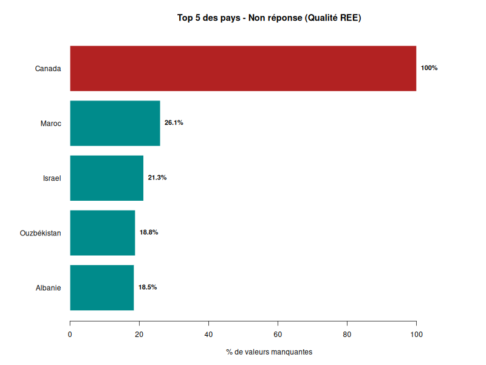

\renewcommand{\contentsname}{Table des matières}

# Introduction

"La relation élève-enseignant s'intéresse à ce qui se passe entre l'enseignant et ses élèves, à l'école, d'un point de vue à la fois cognitif, affectif et social, au-delà des savoirs scolaires" (Espinosa, 2016). Selon lui, l'enseignement constitue un facteur à part entière de l'éducation des élèves, car même si cette dernière relève majoritairement de la responsabilité des parents, l'impact des professeurs dans la vie des élèves reste non négligeable. Ainsi, cette affirmation s'observe-t-elle réellement dans la réalité ? La relation entre les élèves et leurs enseignants ne se limite-t-elle pas uniquement à un cadre scolaire ? Une bonne relation élève/enseignant implique-t-elle la performance académique de l'élève ? Toutes ces interrogations nous amènent à nous intéresser au sujet suivant : La relation entre élèves et enseignants (REE).

La relation élèves enseignants caractérise une interaction, qu'elle soit positive ou négative, entretenue entre les élèves et les enseignants. Cette relation s'inscrit dans une dynamique de transmission des savoirs et peut être qualifiée de verticale, dans la mesure où l'enseignant détient un savoir que l'élève est en train d'acquérir. Elle possède également une dimension subjective, puisqu'elle repose en grande partie sur le ressenti des élèves. Ainsi sa mesure repose nécessairement sur des données déclaratives, susceptibles de comporter certains biais.

Dans notre étude nous allons donc mesurer cette REE, et nous nous demanderons si une bonne relation entre élèves et enseignants influence positivement la scolarité des élèves à différentes échelles.

Dans un premier temps, il s’agira de comprendre ce qu’est la relation élèves-enseignants à travers la manière dont elle est perçue par les élèves, ainsi que d’analyser les cas de non-réponse. Ensuite, nous étudierons les liens entre la REE et la réussite scolaire, en tenant compte des performances individuelles, des différences entre pays et du contexte socio-économique. Enfin, nous nous intéresserons aux relations entre la REE et le bien-être des élèves dans le cadre scolaire, notamment en termes d’anxiété et de relations entre pairs.

Les données utilisées sont issues de l'enquête PISA 2022, qui interroge des élèves âgés de 15 habitant dans 85 pays. Cette base de données permet d'accéder à des informations portant sur les performances scolaires, le contexte socio-économique des élèves, leur ressenti vis-à-vis de l'école ainsi que leur relation avec leurs enseignants.


```{r, echo = FALSE, include = FALSE, warning=FALSE, message = FALSE}


packages <- c("ggplot2", "dplyr", "corrplot","GGally","psych","FactoMineR","factoextra", "tidyverse","ggrepel","rnaturalearth","rnaturalearthdata","sf","kableExtra")
install.packages(packages) 
library(tidyverse)
library(psych)
library(FactoMineR)
library(factoextra)
library(corrplot)
library(ggrepel)
library(rnaturalearth)
library(rnaturalearthdata)
library(knitr)
library(kableExtra)
```

```{r, echo = FALSE, include = FALSE}
# Importation des données
data <- readRDS("stu_qqq.rds")
```

```{r, echo = FALSE, include = FALSE}
matieres <- c(
"MATH", #Mathématiques générales
"READ", #Lecture
"SCIE", #Science
"MCCR", #Mathématiques : Changement et relation
"MCQN", #Mathématiques : Quantitatif
"MCSS", #Mathématiques : Espace et formes
"MCUD", #Mathématiques : Incertitude et données
"MPEM", #Mathématiques : Employer des concepts mathématiques, définitions et théorèmes
"MPFS", #Mathématiques : Formuler des situations mathématiquement
"MPIN", #Mathématiques : Interpréter, appliquer et analyser des sorties mathématiques
"MPRE" #Mathématiques : Raisonnement
)
```

```{r, echo = FALSE, include = FALSE}
## Gestion des notes
Notes <- data %>% select(starts_with("PV"))
Notes_NA <- data %>% select(starts_with("PV"))
Notes_NA <-lapply(Notes_NA, as.numeric)
moyennes_NA <- lapply(Notes_NA, mean, na.rm = FALSE)
```

```{r, echo = FALSE, include = FALSE}
Notes_moyennes <- as.data.frame(
  sapply(matieres, function(m) {
    vars <- paste0("PV", 1:10, m)
    rowMeans(Notes[, vars], na.rm = TRUE)
  })
)

colnames(Notes_moyennes) <- paste0("MOY_", matieres)

Notes_moyennes$MOY_GENERALE <- rowMeans(Notes_moyennes, na.rm = TRUE)
```

```{r, echo = FALSE, include = FALSE}
# Selection des indices + variables explicatives
vars_collector <- c("RELATST","TEACHSUP","ESCS","ST272Q01JA", "EXPWB","BELONG","BULLIED","ANXMAT","ST267Q01JA", "ST267Q02JA", "ST267Q03JA", "ST267Q04JA", "ST267Q05JA", "ST267Q06JA", "ST267Q07JA", "ST267Q08JA","ST270Q01JA", "ST270Q02JA", "ST270Q03JA", "ST270Q04JA","ST268Q01JA","ST268Q02JA", "ST268Q03JA","OECD")

vars_etude <- vars_collector[vars_collector %in% names(data)]

idx_vars_etude <- match(vars_etude, names(data))

data_etude <- c(data[, c(1,26, idx_vars_etude), drop = FALSE],Notes_moyennes[c(1,12)])
data_etude <- as.data.frame(data_etude)
rm(data,Notes,Notes_moyennes,Notes_NA)
```

```{r, echo = FALSE, include = FALSE}
# Conversion en facteur
data_etude$ST004D01T <- as.factor(data_etude$ST004D01T)
```

# 1 Comprendre la relation élève-enseignant

## 1.1 Cadre d'analyse de la REE
En premier lieu, afin de définir le cadre dans lequel nous nous plaçons, il faut avant tout préciser comment se caractérisent élèves et enseignants dans le questionnaire PISA. En effet, pour un élève, il s'agit ici d'un enfant âgé d'environ 15 ans inscrit dans un établissement scolaire public, privé ou bien spécialisé et pouvant provenir de 85 pays différents pour l'édition 2022. Par ailleurs, les enseignants sont, par définition, les professeurs des élèves interrogés dans l'enquête PISA.

Ainsi, nous nous plaçons dans un contexte particulier d'analyse puisqu'il faut dans notre cas, étudier la REE grâce aux données présentes sur les questionnaire PISA 2022. Cette base de données permet d'accéder à des informations portant sur les performances scolaires, le contexte socio-économique des élèves, leur ressenti vis-à-vis de l'école ainsi que leur relation avec leurs enseignants. C'est pourquoi, afin de pouvoir réaliser notre étude, il nous fallait proposer une mesure des différents types de REE sur lesquels nous souhaitons nous appuyer. Ainsi, nous avons utilisé deux indices déjà créés par l'OCDE afin de caractériser cette relation. En particulier, nous avons choisi de travailler avec l'indice mesurant la REE globale, qui comprend des questions générales sur le ressenti de l'élève quant à ses interactions avec leur enseignants, mais également l'indice mesurant la REE ciblée sur les professeurs de mathématiques. Ces indices sont compris entre -4 et 4 et plus il est positif, plus l'élève affirme avoir une bonne REE/bénéficier d’un soutien de son enseignant de mathématiques.

Toutefois, une potentielle limite de notre analyse mais inhérente au questionnaire PISA, est qu'il ne prend en compte la REE que dans un seul sens. En effet, dans la réalité, les enseignants ont une influence sur leurs élèves mais l'inverse est aussi véridique, les élèves peuvent modifier le comportement de leurs professeurs. Cependant, ce deuxième sens dans la REE ne peut être vérifié dans cette enquête, car seuls les élèves expriment leur opinion sur leurs professeurs.

## 1.2 Les profils des élèves qui ne se positionnent pas sur leur relation avec le corps enseignant
Pour commencer notre analyse, nous allons regarder le profil des élèves qui n'ont pas d'indices REE global ou de REE ciblée sur les professeurs de mathématiques. 

```{r, echo = FALSE}


# Profil des NA
profil_NA <- data_etude %>%
  filter(is.na(RELATST) | is.na(TEACHSUP)) %>%
  summarise(
    Groupe = "Manquant",
    Pourcentage_filles = round(100 * mean(ST004D01T == 1, na.rm = TRUE), 2),
    Origine_socioeco = mean(ESCS, na.rm = TRUE),
    Anxiete_maths = mean(ANXMAT, na.rm = TRUE),
    Appartenance = mean(BELONG, na.rm = TRUE),
    Harcelement = mean(BULLIED, na.rm = TRUE),
    Nombre_total = n()
  )

# Profil sans NA (cas complets sur RELATST)
profil_nonNA <- data_etude %>%
  filter(!is.na(RELATST) & !is.na(TEACHSUP)) %>%
  summarise(
    Groupe = "Sans NA",
    Pourcentage_filles = round(100 * mean(ST004D01T == 1, na.rm = TRUE), 2),
    Origine_socioeco = mean(ESCS, na.rm = TRUE),
    Anxiete_maths = mean(ANXMAT, na.rm = TRUE),
    Appartenance = mean(BELONG, na.rm = TRUE),
    Harcelement = mean(BULLIED, na.rm = TRUE),
    Nombre_total = n()
  )


```


```{r, results='asis'}
library(gridExtra)
library(grid)

df <- data.frame(
  Groupe = c("Manquant", "Sans NA"),
  Pourcentage_filles = c(45.96, 51.18),
  Origine_socioeco = c(-0.6687436, -0.1969157),
  Anxiete_maths = c(0.3075299, 0.2216972),
  Appartenance = c(-0.20697179, -0.04908496),
  Harcelement = c(-0.1214952, -0.3056764),
  Nombre_total = c(159590, 454154)
)

g <- tableGrob(df, rows = NULL)

png("images_rapports/tableau1_manquants_NA.png",
    width = 700, height = 160)

grid.newpage()

# ⚠️ IMPORTANT : on force le viewport à remplir toute la page
pushViewport(viewport(x = 0.5, y = 0.5,
                      width = 1, height = 1,
                      just = c("center", "center")))

grid.draw(g)

dev.off()
```


Ce tableau séparer les données en deux, les "manquant", c'est à dire les élèves n'ayant pas de REE global ou de REE ciblée sur les professeurs de mathématiques, et "Sans NA".

Les manquants représentent 159590 données c'est-à-dire 26% de nos données. A partir de cela nous pouvons faire un premier profil des élèves qui ne se positionnent pas sur leur relation avec le corps enseignant. En premier lieu, le groupe "manquant" comprend plus de garçons que le groupe qui se positionne sur leur relation avec le corps enseignant, et est légèrement plus anxieux en mathématiques.  Trois indices ont une différences plus marquée, le premier montre que le sentimant d'appartenance pour le groupe "manquant" est plus faible que l'autre groupe avec un écart de 0.16 points. L'harcèlement augmente aussi, passant de -0.30 à -0.12 et enfin l'indice sur l'origine socio-économique diminue fortement, passant de -0.20 pour le groupe ayant répondu aux question à -0.67 pour le groupe "manquant". 

Pour faire un résumé nos données manquant ont le profil suivant par rapport aux autres données: On y retrouve plus de garçons, plus anxieux envers les mathématiques, plus harcelé et avec un moins bon sentiment d'appartenance et pour finir une origine socio-économique beaucoup plus faible.

Cependant lorsqu'on regarde en détail ces non-réponses on retrouve quelques informations très importantes.


```{r, echo = FALSE}
# 0. Chemin du fichier PNG
png(filename = "images_rapports/figure1_top5_pays_NA.png", width = 800, height = 600)

# 1. Préparation des données
relatst_NA_ligne <- is.na(data_etude$RELATST) & is.na(data_etude$TEACHSUP)
relatst_NA_pays <- tapply(relatst_NA_ligne, data_etude$CNT, mean) * 100
relatst_NA_pays_tri <- sort(relatst_NA_pays)

top5 <- tail(relatst_NA_pays_tri, 5)

# 2. Création des noms complets
noms_complets <- names(top5)
noms_complets[noms_complets == "CAN"] <- "Canada"
noms_complets[noms_complets == "MAR"] <- "Maroc"
noms_complets[noms_complets == "ISR"] <- "Israel"
noms_complets[noms_complets == "UZB"] <- "Ouzbékistan"
noms_complets[noms_complets == "ALB"] <- "Albanie"

# 3. Graphique du Top 5
par(mar = c(5, 8, 4, 2)) # marge gauche pour noms longs

bp <- barplot(
  top5,
  horiz = TRUE,
  names.arg = noms_complets,
  las = 1,
  col = ifelse(names(top5) == "CAN", "firebrick", "darkcyan"),
  main = "Top 5 des pays - Non réponse (Qualité REE)",
  xlab = "% de valeurs manquantes",
  xlim = c(0, 115),
  border = "white"
)

# 4. Ajout des pourcentages précis
text(
  x = top5, 
  y = bp, 
  labels = paste0(round(top5, 1), "%"), 
  pos = 4, 
  cex = 0.9, 
  font = 2
)

# 5. Fermer le fichier PNG
dev.off()
```
Note de lecture : Le Brunei a un taux de non réponse de 100% sur les données concernant l'indice de qualité de la relation entre élèves et enseignants.

L'enquête PISA se base sur un questionnaire distribué par les pays dans les écoles, toutefois, chaque partie du questionnaire étant facultative, un pays a pu refuser sa distribution pour certaines raisons. Pour les indices mesurant la relation entre élèves et enseignants dans la globalité et la relation avec le professeur de mathématiques on retrouve le CANADA avec un taux de non-réponses égal à 100%. . On peut donc améliorer notre profil en disant que  Les pays sont Brunei, Canada, Indonésie, Israël, Cambodge, Macao, Maroc, Malaisie, Philippines et Ouzbékistan. Cependant d'après nos recherches aucune raison officielle ne permet de conclure sur la raison de la non distribution de cette partie du questionnaire.


```{r, echo = FALSE,include = FALSE}
relatst_100 <- relatst_NA_pays_tri[relatst_NA_pays_tri == 100]
names(relatst_100)
```

Cependant lorsqu'on regarde en détail ces non-réponses on retrouve quelques informations très importantes.



Note de lecture : Le Canada a un taux de non réponse de 100% sur les données concernant l'indice de qualité de la relation entre élèves et enseignants et l'indice de qualité de relation entre élèves et enseignants de mathématiques

-> Paragraphe à améliorer
L'enquête PISA se base sur un questionnaire distribué par les pays dans les écoles, toutefois, chaque partie du questionnaire étant facultative, un pays a pu refuser sa distribution pour certaines raisons. Pour les indices mesurant la relation entre élèves et enseignants dans la globalité et la relation avec le professeur de mathématiques on retrouve le CANADA avec un taux de non-réponses égal à 100%. De plus d'autres pays ont un taux de non réponse aux alentours de 20%, on retrouve le Maroc, l'Israel, l'Ouzbékistan et l'Albanie. D'après nos recherches aucune raison officielle ne permet de conclure sur la raison de la non distribution de cette partie du questionnaire. On peut donc améliorer notre profil en disant que nos élèves n'ayant pas d'indice de REE peuvent venir du Canada, cependant on ne peut pas en tirer des conclusions rationelles sur une répartition logique des élèves n'ayant pas répondu aux questions sur la REE global.


Après avoir “nettoyé” notre base de données, nous pouvons faire une analyse du profil des élèves qui n'ont pas répondu aux questions sur leur relation avec le corps enseignant. En premier lieu, nous voyons que dans la figure 3, il existe une relation entre le fait de ne pas avoir d'indice de REE et la moyenne générale. Ne pas avoir d'indice de REE signifie ne pas avoir répondu à toutes les questions qui servent à construire celui-ci. En effet on remarque que la distribution de la moyenne générale des élèves n'ayant pas d'indice de REE est plus centrée sur la gauche que la distribution pour les élèves ayant un indice de REE. On peut donc en conclure que les élèves qui ne se positionnent pas sur leur relation avec le corps enseignant sont des élèves avec une moyenne générale plus faible que ceux se positionnant.


```{r, echo = FALSE}
pdf("images_rapports/figure2_comparaison_NA_notes_relatst.pdf", width = 5.8, height = 3.8)
data_etude$statut_NA <- ifelse(is.na(data_etude$RELATST), "Manquant", "Présent")
ggplot(data_etude, aes(x = MOY_GENERALE, fill = statut_NA)) +
  geom_histogram(bins = 50, alpha = 0.6, position = "identity") + 
  scale_fill_manual(values = c("Manquant" = "#E69F00", "Présent" = "#56B4E9")) +
  labs(
    title = " Distribution du nombre d'élèves par note et statut de réponse",
    x = "moyenne générale",
    y = "Nombre d'élèves",
    fill = "Statut"
  ) +
  theme_minimal()
dev.off()

```
```{r, echo = FALSE}
pdf("images_rapports/figure3_comparaison_NA_notesmaths_teachsup.pdf", width = 5.8, height = 3.8)
data_etude$statut_NA <- ifelse(is.na(data_etude$TEACHSUP), "Manquant", "Présent")
ggplot(data_etude, aes(x = MOY_MATH, fill = statut_NA)) +
  geom_histogram(bins = 50, alpha = 0.6, position = "identity") + 
  scale_fill_manual(values = c("Manquant" = "#E69F00", "Présent" = "#56B4E9")) +
  labs(
    title = " Distribution du nombre d'élèves par note et statut de réponse",
    x = "moyenne générale",
    y = "Nombre d'élèves",
    fill = "Statut"
  ) +
  theme_minimal()
dev.off()
```
Note de lecture : La distribution de la moyenne générale des élèves n'ayant pas d'indice de REE est plus centrée sur la gauche que la distribution pour les élèves ayant un indice de REE.

Concernant les autres variables nous pouvons analyser remarquer grâce au tableau 1, que les élèves n'ayant pas d'indice REE sont du genre plutôt masculin. En effet, on retrouve 38.2% de femmes pour un indice REE manquant quand celui-ci est à 49.7% pour l'ensemble des données. 


Table 1: Comparaison entre les élèves ayant un indice REE et ceux n'en ayant pas .

Note de lecture: Pour les élèves n'ayant pas d'indice REE, leur indice d'anxiété moyen relatif aux mathématiques est de 0.381.


Blabla conclusion du profil
```{r, echo = FALSE}
summary(data_etude)
```
```{r, echo = FALSE}
library(gridExtra)
library(grid)

cols_selection <- c("RELATST", "TEACHSUP", "ESCS", "EXPWB", "BELONG", "BULLIED", "ANXMAT")
data_etude_clean <- data_etude[, cols_selection]

get_clean_summary <- function(x) {
  s <- summary(x, na.rm = TRUE)
  as.vector(s)[1:6]
}

summary_mat <- sapply(data_etude_clean, get_clean_summary)
summary_df <- as.data.frame(summary_mat)

rownames(summary_df) <- c("Min", "1st Qu.", "Median", "Mean", "3rd Qu.", "Max")
summary_df <- round(summary_df, 3)

png("summary_table.png", width = 1100, height = 380, res = 120)

mon_theme <- ttheme_default(
  base_size = 11,   # légèrement réduit
  colhead = list(
    fg_params = list(fontface = "bold", col="white"),
    bg_params = list(fill="#4F81BD")
  ),
  core = list(
    bg_params = list(fill = c("#D9E1F2", "white"))
  )
)

grid.newpage()

# 🔥 suppression du centrage + remplissage total
pushViewport(viewport(
  x = 0, y = 1,
  just = c("left", "top"),
  width = 1,
  height = 1
))

grid.table(summary_df, theme = mon_theme)

dev.off()
```
## 1.4 Une relation décrite comme globalement positive au travers du vécu de l'élève.
Il paraît maintenant pertinent de s'intéresser à la qualité de cette relation et savoir comment elle est perçue par les élèves. Car un indice relève en effet de la qualité globale de la relation, mais il est aussi important de savoir le détail par question. Pour cela nous avons récupéré le taux des réponses positives par question en ce qui concerne la relation élève-enseignant au global et celle sur les professeurs de mathématiques, seulement pour les élèves ayant répondu à la question. 
On remarque que les résultats sont très positifs, la question ayant le moins bon résultat est "Les enseignants font attention aux élèves en cas de retard", avec 72,7% de réponses positives. Donc pour seulement 27.3% des élèves, l'enseignant ne fait pas attention. Quant aux autres résultats, ils se situent entre 79.4% et 94.2% de réponses positives donc seulement 20.6% et 4.8% de réponses négatives. On peut conclure que les trois qualités qui caractérisent au mieux cette relation positive sont un enseignant qui n'est pas méchant, qui est amical et qui se soucie du bien-être des élèves.


```{r, echo = FALSE}
pdf("images_rapports/figure5_Reponses_indiquant_une _relation_positive.pdf", width = 5.7, height = 3.7)

data_relatst_na <- data_etude %>% select(ST267Q01JA, ST267Q02JA, ST267Q03JA, ST267Q04JA, ST267Q05JA, ST267Q06JA, ST267Q07JA, ST267Q08JA)
data_relatst <- na.omit(data_relatst_na)
# Questions sur la REE positive

data_relatst$ST267Q01JA <- ifelse(data_relatst$ST267Q01JA %in% c(3,4), 1, 0)
data_relatst$ST267Q02JA <- ifelse(data_relatst$ST267Q02JA %in% c(3,4), 1, 0)
data_relatst$ST267Q03JA <- ifelse(data_relatst$ST267Q03JA %in% c(3,4), 1, 0)
data_relatst$ST267Q04JA <- ifelse(data_relatst$ST267Q04JA %in% c(1,2), 1, 0)
data_relatst$ST267Q05JA <- ifelse(data_relatst$ST267Q05JA %in% c(3,4), 1, 0)
data_relatst$ST267Q06JA <- ifelse(data_relatst$ST267Q06JA %in% c(3,4), 1, 0)
data_relatst$ST267Q07JA <- ifelse(data_relatst$ST267Q07JA %in% c(3,4), 1, 0)
data_relatst$ST267Q08JA <- ifelse(data_relatst$ST267Q08JA %in% c(1,2), 1, 0)

data_long_p <- data_relatst %>%
  select(ST267Q01JA, ST267Q02JA, ST267Q03JA, ST267Q04JA, ST267Q05JA, ST267Q06JA, ST267Q07JA,ST267Q08JA) %>%
  pivot_longer(cols = everything(),
               names_to = "Question",
               values_to = "Relation_positive")

data_plot_p <- data_long_p %>%
  group_by(Question) %>%
  summarise(Pourcentage = mean(Relation_positive, na.rm = TRUE) * 100)

ggplot(data_plot_p, aes(x = Question,
                      y = Pourcentage)) +
  geom_col(fill = "darkcyan", width = 0.7) +
  coord_flip() +
  scale_x_discrete(labels = function(x) stringr::str_wrap(c(
  ST267Q01JA = "Les enseignants sont respectueux",
  ST267Q02JA = "Les enseignants font attention aux élèves en cas de retard",
  ST267Q03JA = "Les enseignants seront heureux de revoir l'élève dans 3 ans",
  ST267Q04JA = "Les enseignants ne sont pas intimidants",
  ST267Q05JA = "Les enseignants s'intéressent aux élèves",
  ST267Q06JA = "Les enseignants sont amicaux",
  ST267Q07JA = "Les enseignants se soucient du bien-être des élèves",
  ST267Q08JA = "Les enseignants ne sont pas méchants"
)[x], width = 40)) +
  labs(title = "Réponses indiquant une relation positive",
       x = "",
       y = "Pourcentage (%)") +
  geom_text(aes(label = round(Pourcentage,1)), hjust = 0, size = 4) +
  ylim(0, 100)+
  theme(
    plot.title = element_text(hjust=1),
    plot.caption = element_text(hjust = 0.20),
    plot.margin = margin(5, 0.5, 5, 5),

  )
dev.off()

```

Note de lecture : 85% des élèves ayant répondu affirment que leurs enseignants sont respectueux envers eux.

Cette relation étant très positive en ce qui concerne les enseignants au global, il semble alors loisible de rentrer plus dans les détails en s'intéressant aux enseignants de mathématiques précisément. On a donc sur la figure suivant le taux de réponse positive pour les questions concernant les enseignants de mathématiques. 

Les résultats sont très différents de ce qu'on a pu observer avec les enseignants dans leur globalité. En effet, les taux de réponses positives se trouvent seulement entre 25.4% et 32.2%, on se retrouve donc avec une majorité de réponses négatives contrairement à la relation globale.

```{r, echo = FALSE}
pdf("images_rapports/figure6_Reponses_indiquant_une_relation_positive_maths.pdf", width = 5.7, height = 3.7)

data_teachsup_na <- data_etude %>% select(ST270Q01JA, ST270Q02JA, ST270Q03JA, ST270Q04JA)
data_teachsup <- na.omit(data_teachsup_na)
# Questions sur la REE positive

data_teachsup$ST270Q01JA <- ifelse(data_teachsup$ST270Q01JA %in% c(3,4), 1, 0)
data_teachsup$ST270Q02JA <- ifelse(data_teachsup$ST270Q02JA %in% c(3,4), 1, 0)
data_teachsup$ST270Q03JA <- ifelse(data_teachsup$ST270Q03JA %in% c(3,4), 1, 0)
data_teachsup$ST270Q04JA <- ifelse(data_teachsup$ST270Q04JA %in% c(3,4), 1, 0)

data_long_t <- data_teachsup %>%
  select(ST270Q01JA, ST270Q02JA, ST270Q03JA, ST270Q04JA) %>%
  pivot_longer(cols = everything(),
               names_to = "Question",
               values_to = "Soutien")

data_plot_t <- data_long_t %>%
  group_by(Question) %>%
  summarise(Pourcentage = mean(Soutien, na.rm = TRUE) * 100)

ggplot(data_plot_t, aes(x = Question,
                      y = Pourcentage)) +
  geom_col(fill = "darkcyan", width = 0.7) +
  coord_flip() +
  scale_x_discrete(labels = function(x) stringr::str_wrap(c(
    ST270Q01JA = "L'enseignant montre de l'intérêt pour l'apprentissage des élèves.",
    ST270Q02JA = "L'enseignant apporte de l'aide supplémentaire si besoin.",
    ST270Q03JA = "L'enseignant aide les élèves dans leur apprentissage.",
    ST270Q04JA = "L'enseignant continue d'enseigner jusqu'à ce que les élèves comprennent.")[x], width = 40)) +
  labs(title = "Réponses indiquant une relation positive",
       x = "",
       y = "Pourcentage (%)") +
  geom_text(aes(label = round(Pourcentage,1)), hjust = 0, size = 4) +
  ylim(0, 100)+
  theme(
    plot.title = element_text(hjust=1),
    plot.caption = element_text(hjust = 0.3),
    plot.margin = margin(5, 0.5, 5, 5)
  )
dev.off()

```
Note de lecture : 32.2% des élèves ayant répondu affirment que leur enseignant montre de l'intérêt pour l'apprentissage des élèves.


```{r, echo=FALSE,include= FALSE}
mean(is.na(data_relatst_na))*100
mean(is.na(data_teachsup_na))*100
rm(data_long_p,data_long_t,data_plot_p,data_plot_t,data_relatst,data_relatst_na,data_teachsup,data_teachsup_na)
```

Cependant, nous avons affiché les résultats seulement pour les élèves ayant répondu aux questions. Si l'on regarde le taux de non réponses nous avons 43.04% de non réponses concernant la relations dans la globalité et 15.53% pour la relation avec les professeurs de mathématiques. Le chiffre de non-réponse nous pousse à nous interroger sur le profil des élèves qui ne répondent pas pour comprendre en quoi cela pourrait biaiser nos futures analyses.

-> Malgré qu'on ai enlevé les variables avec indice = Na, il y a encore des individus avec des NA en réponse aux questions, l'indice est donc construit pour ne pas prendre en compte des NA
```{r}
data_etude <- data_etude[(!is.na(data_etude$RELATST)) & (!is.na(data_etude$TEACHSUP)), ]

```

# 2 La REE et la réussite scolaire : une relation complexe

## 2.1 Le niveau académique individuel n'explique pas la qualité de la REE

La relation élèves-enseignant peut être étudiée dans le cadre de la réussite scolaire et plus précisemment avec le niveau académique des élèves.
Comme la REE est une relation prenant place au sein des établissements scolaires, il est tout à fait naturel de s'interroger sur l'influence de la REE sur le niveau des élèves et inversement.
Le niveau scolaire est ici étudié au travers des notes établies par l'OCDE lors de l'enquête PISA 2022.
Celles-ci permettent de connaître le niveau relatif des élèves concernant différents domaines d'études : les mathématiques, la compréhension de l'écrit et les sciences.
Pour comprendre au mieux la relation que le niveau scolaire peut entretenir avec la REE, les analyses vont se porter sur la moyenne générale obtenue par les élèves ainsi que leur moyenne de mathématiques.

```{r, echo=FALSE}
pdf("images_rapports/figure7_matrice_correlation_variables.pdf", width = 5.5, height = 3.5)

REE_notes <- data_etude %>%
  select(RELATST, TEACHSUP, MOY_GENERALE, MOY_MATH)
colnames(REE_notes) <- c("REE", "REE maths", "Moyenne G", "Notes maths")


cor_REE_notes <- cor(REE_notes)

corrplot(
  cor_REE_notes,
  method = "color",
  type = "upper",
  col = colorRampPalette(c("#2c7bb6", "white", "#d7191c"))(200),
  tl.col = "black",
  tl.srt = 45,
  addCoef.col = "black",
  number.cex = 0.7,
  diag = FALSE
)
dev.off()

```

Note de lecture : La corrélation entre la relation élèves-enseignants (REE) et la moyenne générale est de 0.06.

Ainsi, contrairement à ce que l’on peut penser a priori, le niveau académique des élèves n'explique pas la qualité de la relation avec leurs enseignants.
Le lien de corrélation est presque nul (0.06).
Par conséquent, un élève peut potentiellement bien s’entendre avec son professeur sans pour autant que cela ait une influence sur ses résultats scolaires.
D’autres facteurs semblent donc être à la source de la réussite scolaire des élèves qu’une bonne relation entre élève et enseignant au niveau global.

## 2.2 Le niveau académique national est corrélée négativement avec la qualité de la REE

Comme on constate qu'il n'y a pas de lien entre REE et notes pour les élèves, on peut aussi étudier cette relation à l'échelle des pays.
Dans cette analyse, on utilise la moyenne de REE dans chaque pays et la moyenne des notes obtenues.
Cela permet de comparer les niveau nationaux et donc de comparer les différents systèmes éducatifs et leurs influences sur la REE.

```{r, echo=FALSE, include=FALSE}
# Test de corrélation entre la note moyenne d'un pays et son indice RELATST moyen
bilan_pays_CNT <- data_etude %>%
  group_by(CNT) %>%
  summarise(
    REE_moyen = mean(RELATST, na.rm = TRUE),
    Note_moyenne = mean(MOY_GENERALE, na.rm = TRUE),
    REE_maths = mean(TEACHSUP, na.rm = TRUE),
    Note_maths = mean(MOY_MATH, na.rm = TRUE),
    ESCS_moyen = mean(ESCS, na.rm = TRUE),
    qualite_moyen = mean(ST272Q01JA, na.rm = TRUE),
    Effectif = n()) 
cor.test(bilan_pays_CNT$REE_moyen, bilan_pays_CNT$Note_moyenne)

# Renomme les pays avec leur nom entier
correspondance_pays <- data.frame(
  iso_a3 = c("ALB", "ARG", "AUS", "AUT", "QAZ", "BEL", "BRA", "BRN", "BGR", "KHM", 
             "CAN", "CHL", "TAP", "COL", "CRI", "HRV", "QCY", "CZE", "DNK", "DOM", 
             "SLV", "EST", "FIN", "FRA", "GEO", "DEU", "GRC", "GTM", "HKG", "HUN", 
             "ISL", "IDN", "IRL", "ISR", "ITA", "JAM", "JPN", "JOR", "KAZ", "KOR", 
             "KSV", "LVA", "LTU", "MAC", "MYS", "MLT", "MEX", "MNG", "MNE", "MAR", 
             "NLD", "NZL", "MKD", "NOR", "PSE", "PAN", "PRY", "PER", "PHL", "POL", 
             "PRT", "QAT", "MDA", "ROU", "SAU", "SRB", "SGP", "SVK", "SVN", "ESP", 
             "SWE", "CHE", "THA", "TUR", "QUR", "ARE", "QUK", "QSC", "USA", "URY", "UZB", "VNM", "GBR"),
  nom_complet = c("Albania", "Argentina", "Australia", "Austria", "Baku (Azerbaijan)", "Belgium", "Brazil", "Brunei", "Bulgaria", "Cambodia","Canada", "Chile", "Chinese Taipei", "Colombia", "Costa Rica", "Croatia", "Cyprus", "Czech Republic", "Denmark", "Dominican Republic", "El Salvador", "Estonia", "Finland", "France", "Georgia", "Germany", "Greece", "Guatemala", "Hong Kong", "Hungary","Iceland", "Indonesia", "Ireland", "Israel", "Italy", "Jamaica", "Japan", "Jordan", "Kazakhstan", "Korea","Kosovo", "Latvia", "Lithuania", "Macao", "Malaysia", "Malta", "Mexico", "Mongolia", "Montenegro", "Morocco","Netherlands", "New Zealand", "North Macedonia", "Norway", "Palestinian Authority", "Panama", "Paraguay", "Peru", "Philippines", "Poland","Portugal", "Qatar", "Moldova", "Romania", "Saudi Arabia", "Serbia", "Singapore", "Slovak Republic", "Slovenia", "Spain","Sweden", "Switzerland", "Thailand", "Türkiye", "Ukraine", "United Arab Emirates", "United Kingdom", "Scotland", "United States", "Uruguay", "Uzbekistan", "Viet Nam", "Great Britain")
)

bilan_pays <- bilan_pays_CNT %>%
  na.omit() %>% 
  column_to_rownames("CNT")

# On transforme le tableau pour intégrer les noms complets
bilan_pays <- bilan_pays %>%
  rownames_to_column("iso_a3") %>%
  left_join(correspondance_pays, by = "iso_a3") %>%
  mutate(nom_complet = ifelse(is.na(nom_complet), iso_a3, nom_complet)) %>%
  select(-iso_a3) %>%
  column_to_rownames("nom_complet")

bilan_pays <- bilan_pays %>%
  rownames_to_column(var = "nom_complet")
```

Il existe une corrélation négative faible entre la qualité de la REE et la note moyenne de chaque pays (r =\~ -0,26).
La REE n'explique que partiellement le niveau académique mais d'autres facteurs entre en compte.
On ne peut donc pas conclure d'une relation très forte entre ces deux indicateurs.

En se concentrant sur la REE avec les enseignants de mathématiques, on observe des résultats plus marqués.
La note moyenne utilisée est désormais celle des mathématiques et non plus la moyenne générale.

```{r, echo = FALSE, include=FALSE}
# Test de corrélation entre la note moyenne d'un pays et son indice TEACHSUP moyen
cor.test(bilan_pays$REE_maths, bilan_pays$Note_moyenne)
```

Plus un pays dispose d’un niveau en mathématiques élevé selon les notes de l'OCDE, moins la relation entre les élèves et les enseignants de mathématiques est jugée positive.
En effet, on constate une corrélation négative (r =\~ -0.51, p-value =\~ 5e-06) entre la qualité de la REE moyenne d'un pays et sa note OCDE moyenne concernant les mathématiques.

```{r, echo = FALSE, warning= FALSE}

pdf("images_rapports/figure8_Corrélation_entre_la_note_moyenne_en_maths_et_la_relation_avec_lenseignant_de_mathématiques.pdf", width = 6, height = 4)

# Regression linéaire entre l'indice RELATST moyen d'un pays et la note moyenne obtenue par ce pays
modele_TEACHSUP <- lm(Note_moyenne ~ REE_maths, data = bilan_pays)
ggplot(bilan_pays, aes(x = REE_maths, y = Note_moyenne)) +
  geom_smooth(method = "lm", color = "grey", linetype = "dashed", se = FALSE) +
  geom_point(alpha = 0.5, color = "darkcyan") +
  geom_text_repel( aes(label = nom_complet),
                  size = 3,
                  box.padding = 0.5, 
                  point.padding = 0.3,
                  segment.color = "grey50") +
  geom_hline(yintercept = mean(bilan_pays$Note_moyenne, na.rm = TRUE), 
             linetype = "dotted", color = "#2c7bb6", size = 0.8) +
  labs(title = "Corrélation entre la note moyenne en maths et la relation avec \nl'enseignant de mathématiques", subtitle = "En rouge, les pays ne confirmant pas la corrélation. \nLes lignes en pointillée bleues correspondent aux moyennes. ", x = "Indice de relation moyen avec l'enseignant de maths", y = "Note OCDE moyenne en mathématiques")+
  geom_vline(xintercept = mean(bilan_pays$REE_maths, na.rm = TRUE),
             linetype = "dotted", color = "#2c7bb6", size = 0.8) +
  theme_minimal() +
  theme(legend.position = "none")
dev.off()
```

Note de lecture : Le Kazakhstan (KAZ) a un niveau moyen en mathématiques (445) équivalent à la moyenne des pays interrogés et un indice de REE moyen plus positif qu'en moyenne (0.45).

Certains pays ne suivent pas cette corrélation négative, comme Singapour (SGP) où la relation avec les enseignants de mathématiques est plus postive de 0.4 point qu'en moyenne dans les pays de l'OCDE.
De plus, le niveau moyen en mathématiques y est le plus élevé.
Le Guatemala (GTM) confirme bien le lien de corrélation.
Le niveau moyen en mathématiques est largement en dessous de la moyenne, alors qu'on y retrouve la meilleure REE moyenne.

## 2.3 La REE et l'influence du statut socio-économique

Si les notes et la REE sont corrélées, on peut tout de même s'interroger sur l'influence du statut socio-économique des parents dans la relation qu'entretient l'élève avec les enseignants.
Autrement dit, les origines sociales des élèves modifient-elles la manière dont ils intéragissent avec le corps enseignant ?

### 2.3.1 L'origine sociale des élèves n'explique pas la qualité de la REE

```{r, echo=FALSE, warning=FALSE}

pdf("images_rapports/figure9_La_relation_élève-enseignant_selon_le_statut_socio-économique_des_parents.pdf", width = 5.5, height = 3.5)

# Dispersion de l'indice RELATST en fonction des quartiles socio-éco
etude_ESCS <- data_etude %>% mutate(Quartile_Social = ntile(ESCS, 4))
etude_ESCS %>%
  ggplot(aes(x = factor(Quartile_Social), y = RELATST, fill = factor(Quartile_Social))) +
  geom_boxplot(alpha = 0.6, outlier.shape = NA, width = 0.6) +
  stat_summary(fun = mean, geom = "point", shape = 18, size = 3, color = "red") +
  scale_x_discrete(labels = c("1\n25% les plus défavorisés", "2", "3", "4\n25% les plus favorisés")) +
  scale_fill_viridis_d(option = "mako", begin = 0.3, end = 0.8) +
  coord_cartesian(ylim = c(-2.5, 2.5)) +
  labs(
    title = "La relation élève-enseignant selon le statut socio-économique",
    x = "Quartiles socio-économiques",
    y = "Indice REE",
    caption = "Source : Données PISA 2022"
  ) +
  theme_minimal() +
  theme(
    legend.position = "none",
    panel.grid.minor = element_blank(),
    plot.title = element_text(face = "bold", size = 12),
    axis.text.x = element_text(size = 10)
  )
dev.off()

```

Note de lecture : Les 50 % d'élèves situés parmi les plus défavorisés (quartile 1) rapportent des scores d'indice de REE compris entre environ -0,7 et +0,8.

Note : L'indice REE est une variable composite : une valeur positive indique une perception de la relation plus chaleureuse et soutenante que la moyenne de l'OCDE, tandis qu'une valeur négative indique une relation perçue comme plus distante ou moins aidante.
Les losanges rouges représentent la moyenne arithmétique de chaque groupe, tandis que la ligne noire horizontale à l'intérieur de chaque boîte indique la médiane (50 % des élèves se situent au-dessus, 50 % en dessous).

Le statut socio-économique des parents n'influence pas la qualité de la relation entre élèves et enseignants, comme le montre le graphique ci-dessus.
Le vécu des élèves apparaît comme similaire quelques soient les origines sociales.
Les écarts inter-quartile sont très similaires pour les quatres groupes socio-économiques, tout comme les moyennes et les médianes.

```{r, echo = FALSE, warning = FALSE}
pdf("images_rapports/figure10_La_relation_avec_lenseignant_de_mathématique_selon_le_statut_socio-économique_des_parents.pdf", width = 5.5, height = 3.5)

# Dispersion de l'indice TEACHSUP en fonction des quartiles socio-éco
etude_ESCS <- data_etude %>% mutate(Quartile_Social = ntile(ESCS, 4))
etude_ESCS %>%
  ggplot(aes(x = factor(Quartile_Social), y = TEACHSUP, fill = factor(Quartile_Social))) +
  geom_boxplot(alpha = 0.6, outlier.shape = NA, width = 0.6) +
  stat_summary(fun = mean, geom = "point", shape = 18, size = 3, color = "red") +
  scale_x_discrete(labels = c("1\n25% les plus défavorisés", "2", "3", "4\n25% les plus favorisés")) +
  scale_fill_viridis_d(option = "mako", begin = 0.3, end = 0.8) +
  coord_cartesian(ylim = c(-2.5, 2.5)) +
  labs(
    title = "La relation avec l'enseignant de maths selon le statut socio-économique",
    x = "Quartiles socio-économiques",
    y = "Indice REE maths",
    caption = "Source : Données PISA 2022"
  ) +
  theme_minimal()+
  theme(
    legend.position = "none",
    panel.grid.minor = element_blank(),
    plot.title = element_text(face = "bold", size = 10),
    axis.text.x = element_text(size = 9)
  )
dev.off()

```

Note de lecture : L'indice moyen de relation avec l'enseignant de mathématiques pour les élèves appartenant au quart le plus défavorisé de la population (quartile 1) se situe entre -0.3 et 1.5 pour la moitié d'entre eux (dans la "boîte").

Cette dispersion autour de la qualité de la REE moyenne de l'OCDE change lorsqu'on s'intéresse à la relation dans le cadre des mathématiques.
Les "boîtes" des trois premiers quartiles sont plus hautes.
Autrement dit, l'écart interquartile est plus important pour les 25% des élèves les plus défavorisés, qui ont un vécu de la REE avec l'enseignant de mathématiques plus hétérogène, allant de -0.3 à 1.5.

### 2.3.2 La qualité de la REE moyenne est corrélée à l'origine sociale au sein de chaque pays

```{r, echo = FALSE, include=FALSE}
cor.test(bilan_pays$ESCS_moyen, bilan_pays$REE_moyen)
```

A l'échelle nationale, la REE et le statut socio-économique sont corrélés négativement (-0.41).
Lorsque dans un pays le statut socio-économique moyen a tendance à être plus défavorisés, les élèves observent en moyenne une meilleure relation avec leurs enseignants.
Inversement, dans les pays avec un statut socio-économique moyen davatange favorisé, la REE est jugée plus négativement.

```{r, echo=FALSE}
pdf("images_rapports/figure11_Corrélation_entre_le_statut_socio-économique_moyen_et_la_REE_moyenne_des_pays.pdf", width = 6, height = 4)

modele_ESCS <- lm(ESCS_moyen ~ REE_moyen, data = bilan_pays)
ggplot(bilan_pays, aes(x = REE_moyen, y = ESCS_moyen)) +
  geom_smooth(method = "lm", color = "grey", linetype = "dashed", se = FALSE) +
  geom_point(alpha = 0.5, color = "darkcyan") +
  geom_text_repel( aes(label = nom_complet),
                  size = 3,
                  box.padding = 0.5, 
                  point.padding = 0.3,
                  segment.color = "grey50") +
  geom_hline(yintercept = mean(bilan_pays$ESCS_moyen, na.rm = TRUE), 
             linetype = "dotted", color = "#2c7bb6", size = 0.8) +
  geom_vline(xintercept = mean(bilan_pays$REE_moyen, na.rm = TRUE), 
             linetype = "dotted", color = "#2c7bb6", size = 0.8) +
  labs(title = "Corrélation entre le statut socio-économique moyen et \nla REE moyenne des pays", subtitle = "Les lignes en pointillée bleues correspondent aux moyennes. ", x = "Indice de relation moyen avec les enseignants", y = "Indice de statut socio-économique moyen")+
  theme_minimal() +
  theme(legend.position = "none")
dev.off()
```

Note de lecture : L'Albanie (ALB) a un indice socio-économique moyen inférieur à la moyenne des pays interrogés (-0.75) ainsi qu'un indice de REE moyen supérieur à la moyenne (0.3).

Le grapique illustre les différences de systèmes éducatifs entre les différents pays interrogés.
En effet, si à l'échelle individuelle on ne constate pas de relation de corrélation significative entre les orgines sociales et la qualité de la REE, en comparant les différents pays, on peut conclure d'une influence.
Cette corrélation négative oppose des systèmes éducatifs tels que ceux du Vietnam (VNM) ou du Guatemala (GTM) et ceux de la Pologne (POL) ou de la Tchéquie (CZE).
D'un côté, on retouve des pays dont les élèves ont des origines davantage défavorisées et une REE plutôt positive, de l'autre côté des pays dont les élèves ont un statut scoio-économique correspondant à la moyenne OCDE et une REE jugée plus négativement qu'en moyenne au sein des pays de l'OCDE.

On peut en conclure que si, au niveau individuel, aucune corrélation significative n'est observée, une corrélation modérée à forte apparaît au niveau agrégé, c'est-à-dire au niveau des pays.

Cette différence suggère que le lien entre la qualité de la REE et le statut social n'est pas individuel, mais une caractéristique systémique.
Cela révèle le fonctionnement des systèmes éducatifs et leur capacité à créer une relation plus ou moins positive entre les élèves et les enseignants.

::: {.callout-note icon="false"}
### Lien entre le statut socio-économique et le niveau scolaire des élèves

Comme le présentent de nombreuses études, le statut socio-économique des parents est positivement corrélée avec le niveau scolaire. Il est également possible de parler de lien de causalité entre ces deux éléments

"Le statut socio-économique peut avoir une influence considérable sur les résultats de l'apprentissage. Si les mauvais résultats ne découlent pas automatiquement d'un désavantage socio-économique, les écoles reproduisent parfois les schémas existants d'avantages et de désavantages, au lieu de créer une distribution plus équitable des opportunités d'apprentissage et des résultats pour les élèves." [^1]
[^1] : [Causalité entre statut socio-économique et résultats scolaire, OCDE](https://www.oecd.org/fr/topics/sub-issues/student-socio-economic-status.html)

Cette relation se confirme avec une Analyse en composantes principales (ACP).

```{r, echo=FALSE}
pdf("images_rapports/figure_annexe_ACP.pdf", width = 5.5, height = 3.5)

vars_niveau <- data_etude %>%
  select(RELATST, TEACHSUP, MOY_GENERALE, ESCS, ST272Q01JA)
colnames(vars_niveau) <- c("REE", "REE maths", "Moyenne G", "Statut socio-éco", "Qualité maths")
res_pca_psy <- PCA(scale(vars_niveau), graph = FALSE)

fviz_pca_var(
  res_pca_psy,
  col.var = "cos2",   
  gradient.cols = c("cyan2", "darkblue"),  
  repel = TRUE,
  title = "Cercle des corrélations entre les variables de REE et niveau académique"
)
dev.off()
```
La moyenne générale est corrélée avec le statut socio-économique, les deux variables expliquent l'axe 2. Tandis que la qualité des cours de mathématiques et la qualité des relations élèves-enseignants expliquent l'axe 1.

Le lien entre l'origine sociale et le niveau scolaire explique donc la présence de résultats similaires concernant la corrélation entre la qualité de la REE et le niveau académique puis avec le statut socio-économique.

:::

## 2.4 La REE et le rapport aux apprentissages

### 2.4.1 La qualité de la REE est influencée par l'appréciation des cours
Au delà du niveau scolaire ou de statut socio-économique, l'appréciation de l'élève concernant les matières étudiées peut partiellement expliquer la qualité de la REE, notamment concernant la qualité de l'enseignement.

```{r, echo=FALSE, include=FALSE}
cor.test(data_etude$TEACHSUP, data_etude$ST268Q01JA)
cor.test(data_etude$TEACHSUP, data_etude$ST272Q01JA)
```

L'appréciation des mathématiques comme étant l'une des matières préférées de l'élève est légérement corrélée avec la qualité de la relation avec l'enseignement de cette matière.
La corrélation s'élève à environ 0.21 (p-value \< 2.2e-16), ce qui permet de dire qu'il y a bel et bien un lien entre ces deux éléments mais celui-ci reste faible.
Alors, aimer les maths ne suffit pas à expliquer une bonne relation entre un élève et son enseignant de mathématiques.

La qualité perçue des cours de mathématiques est positivement corrélée avec la qualité de la relation avec l'enseignant de mathématiques.
En effet, la corrélation est de 0.41 et est significative (p-value \< 2.2e-16).
La qualité de la REE en maths est donc dépendante de la qualité observée des cours de mathématiques au cours de l'année.

### 2.4.2 Des pays aux systèmes scolaires similaires en fonction de la qualité de la REE

```{r,echo=FALSE, include=FALSE}
cor.test(bilan_pays$qualite_moyen, bilan_pays$REE_moyen)
```

Lorsqu'on change d'échelle, en regardant la qualité observée moyenne des cours de mathématiques par pays, on constate une importante corrélation positive entre qualité des cours et qualité de la REE (0.62, p-value \< 1e-08).
Alors, meilleure est la qualité des cours de mathématique, meilleure est la relation entre les élèves et les enseignants à l'échelle nationale.

```{r, echo=FALSE, warning=FALSE}
pdf("images_rapports/figure12_Corrélation_entre_qualité_cours_maths_et_la_REE_moyenne_des_pays.pdf", width = 6, height = 4)

modele_qualite <- lm(qualite_moyen ~ REE_moyen, data = bilan_pays)
ggplot(bilan_pays, aes(x = REE_moyen, y = qualite_moyen)) +
  geom_smooth(method = "lm", color = "grey", linetype = "dashed", se = FALSE) +
  geom_point(alpha = 0.5, color = "darkcyan") +
  geom_text_repel( aes(label = nom_complet),
                  size = 3,
                  box.padding = 0.5, 
                  point.padding = 0.3,
                  segment.color = "grey50") +
  
  geom_hline(yintercept = mean(bilan_pays$qualite_moyen, na.rm = TRUE), 
             linetype = "dotted", color = "#2c7bb6", size = 0.8) +
  geom_vline(xintercept = mean(bilan_pays$REE_moyen, na.rm = TRUE), 
             linetype = "dotted", color = "#2c7bb6", size = 0.8) +
  labs(title = "Corrélation entre la qualité des cours de maths et \nla REE moyenne des pays", subtitle = "Les lignes en pointillée bleues correspondent aux moyennes. ", x = "Indice de relation moyen avec les enseignants", y = "Score de qualité des cours (/10)")+
  theme_minimal() +
  theme(legend.position = "none")
dev.off()
```
Note de lecture : ...

Avec ce nuage de points, on retrouve la même répartition des différents pays en miroir par rapport aux corrélations avec les notes et le statut socio-économique.

On peut alors se demander si il n'y aurait pas des profils de pays selon la qualité de REE.

Profil pays ?

```{r, echo=FALSE}
pdf("images_rapports/figure13_Typologie_des_pays_selon_la_qualité_des_REE_des_enseignements_en_mathématiques_et_les_notes.pdf", width = 6, height = 4)

mes_couleurs <- c("aquamarine3", "brown3", "darkolivegreen3", "darkgoldenrod2")
library(dplyr)
library(tibble)

df_cluster <- bilan_pays %>%
  select(nom_complet, REE_moyen, Note_moyenne, qualite_moyen) %>%
  na.omit() %>% 
  column_to_rownames("nom_complet")

# On transforme le tableau pour intégrer les noms complets
df_cluster <- df_cluster %>%
  rownames_to_column("iso_a3") %>%
  left_join(correspondance_pays, by = "iso_a3") %>%
  mutate(nom_complet = ifelse(is.na(nom_complet), iso_a3, nom_complet)) %>%
  select(-iso_a3) %>%
  column_to_rownames("nom_complet")

df_scaled <- scale(df_cluster)

set.seed(123)
res_km <- kmeans(df_scaled, centers = 4, nstart = 25)

df_cluster$Groupe <- as.factor(res_km$cluster)

fviz_cluster(res_km, data = df_scaled,
             palette = "jco",
             geom = c("point", "text"),
             labelsize = 8,
             repel = TRUE,
             ellipse.type = "convex", 
             ggtheme = theme_minimal(),
             main = "Typologie des pays selon la qualité des REE, des enseignements en mathématiques et les notes") +
             scale_colour_manual(values = mes_couleurs) +
             scale_fill_manual(values = mes_couleurs)
dev.off()
```
Note de lecture : D'après le regroupement des pays par la méthode du k-means, en fonction de la qualité de la REE, des notes et de la qualité d'enseignement en mathématiques, l'Australie, le Portugal, la Suède et Singapour ont des modèle éducatifs similaires.
```{r, echo=FALSE, include=FALSE}
df_cluster %>%
  group_by(Groupe) %>%
  summarise(across(everything(), mean))
mean(df_cluster$REE_moyen)
mean(df_cluster$Note_moyenne)
mean(df_cluster$qualite_moyen)
```

Tableau des moyennes pour chaque groupe issus du regroupement k-means

| Groupe | Qualité de la REE | Note | Qualité des cours de maths |
|:-----------------|:----------------:|:----------------:|:----------------:|
| 1 | [0.33]{style="color:red"} | [389]{style="color:blue"} | [7.48]{style="color:red"} |
| 2 | [-0.17]{style="color:blue"} | [470]{style="color:red"} | [6.23]{style="color:blue"} |
| 3 | [0.01]{style="color:blue"} | [402]{style="color:blue"} | [6.83]{style="color:red"} |
| 4 | [0.17]{style="color:red"} | [501]{style="color:red"} | [6.49]{style="color:blue"} |
| **Total** | **0.04** | **443** | **6.70** |


Le groupe 1 regroupe des pays ayant en moyenne une meilleure qualité de REE et d'enseignement en mathématiques.
En revanche, ces pays ont des notes bien inférieures à la moyenne, avec une différence de 54 points.
Cette différence représente un peu plus de 2 ans de scolarité en moins pour les élèves de ces pays par rapport à l'ensemble des pays.
Il comprends le Viet Nam, le Pérou ou encore l'Arabie Saoudite.

Le groupe 2, en rouge, est composé de pays ayant une qualité de REE négative en moyenne (-0.17), des notes légèrement au-dessus de la moyenne de l'ensemble des pays interrogés (470 \> 443).
On y retrouve la Grèce, la France ou la Nouvelle-Zélande.

Le groupe 3, en vert, avec des pays comme la Jordanie, la Thailande et leBrésil, a une qualité de REE neutre, des notes plus faibles qu'en moyenne (402) et une qualité d'enseignement en mathématiques l"gèrement supérieure à la moyenne (6.8).

Le groupe 4, en orange est avant tout caractérisé par les notes moyennes obtenues (501).
Les pays qui le composent ont aussi une qualité de REE légèrement positive (0.17), tandis que la qualité d'enseignement est jugée moins bonne qu'en moyenne (6.49).
La Corée du Sud, Hong Kong, l'Australie ainsi que la Norvège en font partie.

Pour mieux se rendre compte des regroupements de pays selon leur qualité de REE, notes et qualité d'enseignement, il est pértinent de les représenter sur une carte.

```{r, echo=FALSE}
pdf("images_rapports/figure14_Répartition_mondiale_des_modèles_de_relation_élève-enseignant.pdf", width = 6, height = 4)

df_analyse <- bilan_pays_CNT %>%
  select(CNT, REE_moyen, Note_moyenne, qualite_moyen) %>%
  na.omit() %>%  # C'est ici que le pays manquant est supprimé
  left_join(correspondance_pays, by = c("CNT" = "iso_a3")) %>%
  mutate(nom_complet = ifelse(is.na(nom_complet), CNT, nom_complet))

df_cluster_final <- df_analyse %>%
  column_to_rownames("nom_complet")

set.seed(123)
res_km_final <- kmeans(scale(df_cluster_final %>% select(REE_moyen, Note_moyenne, qualite_moyen)), 
                       centers = 4, nstart = 25)

df_cluster_final$Groupe <- as.factor(res_km_final$cluster)

world <- ne_countries(scale = "medium", returnclass = "sf")

df_jointure_carte <- df_cluster_final %>%
  rownames_to_column("nom_complet") %>%
  select(CNT, Groupe) %>%
  mutate(CNT = trimws(toupper(CNT))) %>%
  mutate(CNT = case_when(
    CNT == "TAP" ~ "TWN",
    CNT == "QUK" ~ "GBR",
    CNT == "QSC" ~ "GBR",
    TRUE ~ CNT
  ))

world_data <- world %>%
  left_join(df_jointure_carte, by = c("adm0_a3" = "CNT"))

ggplot(data = world_data) +
  geom_sf(aes(fill = Groupe), color = "white", size = 0.1) +
  scale_fill_manual(values = mes_couleurs, 
                    na.value = "lightgrey", 
                    name = "Groupes") +
  theme_minimal() +
  labs(title = "Répartition mondiale des modèles de relation élève-enseignant",
       subtitle = "Selon la méthode du k-means") +
  theme(legend.position = "bottom")
dev.off()

```
Note de lecture : La majorité des pays d'Europe ont des modèles similaires de REE associés aux notes et à la qualité d'enseignement. 


# 3 Existe-t-il une relation entre la REE et le bien-être des élèves dans le cadre scolaire ?

## 3.1 L’étude de la REE et du bien être sous le prisme de l’individu semble ne pas faire valoir un lien très marqué

Nous étudierons ainsi dans quelle mesure cette relation d'enseignant à élève peut impacter le bien-être de ces derniers.

Pour estimer le bien-être des élèves des pays de l’OCDE, nous utiliserons entre-autre l’indice de bien-être ressenti durant les jours précédents. Cet indice est construit grâce à la partie du questionnaire sur le bien-être. L’indice s’affiche comme manquant lorsque l’élève n’a pas répondu “Oui” à la question “La journée d’hier était-elle une journée comme les autres ?”

Les indices suivants peuvent être étudiés afin d’élargir l’analyse et de comprendre quels éléments influencent plus particulièrement les REE comme le harcèlement par exemple. D’autres variables et indices peuvent être retenus pour expliquer la REE tels que l’indice d’anxiété concernant les mathématiques ou encore l’indice du sentiment d’appartenance à l’école, un groupe de camarades.

Il est alors loisible d’apporter quelques précisions sur les indices que nous venons d’évoquer. Ainsi, l’indice sur l’anxiété ressentie concernant les cours de mathématiques permet d’approfondir l’analyse de l’indice de soutien de l’enseignant de mathématiques. Il est construit avec les réponses aux questions concernant la crainte des difficultés en cours de mathématiques ou la crainte de l’échec. En revanche, l’indice sur le sentiment d’appartenance, représente le sentiment d’appartenance de l’élève à son école ainsi que l’existence de relations avec d’autres à l’école.  Enfin, l’indice sur le harcèlement repose sur la fréquence de plusieurs signes de harcèlement durant les 12 derniers mois, d’après les élèves.

En outre, pour savoir si ces indices ont un réel impact sur les différents types de REE nous pouvons étudier la matrice des corrélations ci-dessous : 
```{r,echo=FALSE,include=FALSE}
vars <- data_etude %>%
  select(EXPWB, RELATST, TEACHSUP, ANXMAT, BELONG, BULLIED) %>%
  na.omit()

```

```{r, echo=FALSE}
cor_matrix <- cor(vars)
pdf("images_rapports/figure15_Matrice_de_correlation_bien_etre_REE.pdf", width = 5.5, height = 3.5)

corrplot(
  cor_matrix,
  method = "color",
  type = "upper",
  col = colorRampPalette(c("#2c7bb6", "white", "#d7191c"))(200),
  tl.col = "black",
  tl.srt = 45,
  addCoef.col = "black",
  number.cex = 0.7,
  diag = FALSE
)
dev.off()
```
Figure : Matrice de corrélation des variables
Note de lecture: La corrélation entre l'indice d'appartenance et de harcèlement est de -0.25

Cette matrice de corrélation nous donne un premier aperçu des différentes corrélations entre nos variables REE et les variables de bien-être. Aucune corrélation importante est notable mais quelques petites corrélations peuvent être remarquées comme celle entre la REE globale et le sentiment d'appartenance qui est de 0.27, donc une REE globale élevée est susceptible d’améliorer le sentiment d'appartenance de l'élève. Les autres coefficients de corrélation entre les indices de REE et les variables liées au bien-être comme l’anxiété, le sentiment de harcèlement ou bien le niveau général de bonheur se situent tous entre -0.20 et 0.20. On ne peut pas apporter de conclusion marquée sur une relation entre les variables à en tirer.

Cette matrice montre donc qu’aucune relation n’est visible entre le bien-être et la REE sous le prisme des élèves pris au cas par cas. Cependant, même si on ne peut tirer d’analyses concluantes au niveau individuel, il peut être intéressant de changer de dimension et de se placer à l’échelle d'un pays tout entier. Cela pourra nous permettre de conclure si la méthode d'enseignement d'un pays à un impact global sur le bien-être des élèves du pays concerné

## 3.2 La segmentation de l’échantillon par pays rend l’analyse plus pertinente afin de rendre compte du lien entre bien-être et REE
### 3.2.1 Le lien entre la REE et le bien–être à l'échelle des pays ne se fait également pas remarquer dans une analyse non-discriminante

On étudie cette fois-ci les données regroupées au sein des pays

Si l’analyse du lien entre les variables de bien-être et les indices de REE ne s’est pas révélée très concluante, il peut être plus pertinent de s’intéresser à ce même lien mais au sein des pays pris séparément. Dans cette optique, nous pourrons potientiellement relever si, dans certains systèmes éducatifs, les élèves sont plus heureux que la moyenne.

Un indicateur général de bien-être, est construit à partir des quatres variables caractérisant le bien-être : le sentiment d’appartenance à l’école, le bien-être récent, l’anxiété en mathématiques et l’exposition au harcèlement. Les deux dernières dimensions étant négativement corrélées au bien-être, elles sont inversées afin d’assurer une interprétation homogène de l’indicateur. Ainsi, un score élevé de bien-être traduit systématiquement une situation plus favorable.

```{r, echo=FLASE, incluse=FALSE}
data_etude_bien_etre_moyen <- data_etude %>%
  mutate(
    bien_etre = rowMeans(
      cbind(BELONG, EXPWB, -BULLIED, -ANXMAT),
      na.rm = TRUE
    )
  )
```

```{r, echo = FALSE, include=FALSE}
bilan_pays <- data_etude_bien_etre_moyen %>%
  group_by(CNT) %>%
  summarise(
    REE = mean(RELATST, na.rm = TRUE),
    bien_etre = mean(bien_etre, na.rm = TRUE),
    .groups = "drop"
  )
```
```{r, echo = FALSE, warning= FALSE}
cor(
  subset(bilan_pays)$REE,
  subset(bilan_pays)$bien_etre
)


```

En regroupant les individus simplement par pays, les variables de bien-être n’ont aucun effet sur les relations élèves-enseignants dans le cadre général. Etant donné qu’on fait la moyenne du bien-être dans les pays pour le bien être considéré, on fait la moyenne de la REE dans les pays pour la REE donc il est plutôt normal d’obtenir un coefficient de corrélation pratiquement nul : -0.001. 
Il faut donc trouver un moyen de classifier l’échantillon portant sur un facteur discriminatoire des pays


### 3.2.2 Les résultats relatifs au lien REE et bien-être deviennent notable lorsque l’on segmente l’échantillon selon les types de pays étudiés
#### 3.2.2.1 L’analyse du lien entre bien-être et REE en fonction de l’appartenance à l’OCDE permet d’étoffer notre étude

Un premier facteur permettant de différencier les pays entre eux est l’appartenance à l’OCDE. En effet, l’OCDE (Organisation de Coopération et de Développement Économiques) est une organisation internationale regroupant principalement des pays dits “développés”. Elle promeut des politiques publiques favorisant le bien-être social et l’amélioration des systèmes éducatifs. C’est pourquoi, utiliser ce statut peut être pertinent dans notre analyse. Ainsi, de manière générale dans le cadre des enquêtes PISA, l’appartenance à l’OCDE s'avère jouer un rôle déterminant pour savoir si un élève inscrit son parcours scolaire dans un environnement propice à sa situation sociale et mentale ou non.

```{r,echo=FALSE}
data_oecd_pays <- data_etude %>%
  filter(!is.na(OECD)) %>%
  mutate(
    bien_etre = rowMeans(
      cbind(BELONG, EXPWB, -BULLIED, -ANXMAT),
      na.rm = TRUE
    )
  ) %>%
  group_by(CNT) %>%
  summarise(
    REE = mean(RELATST, na.rm = TRUE),
    bien_etre = mean(bien_etre, na.rm = TRUE),
    OECD = first(OECD),
    .groups = "drop"
  )
```

```{r,echo=FALSE}
cor(subset(data_oecd_pays, OECD == 1)$REE,
    subset(data_oecd_pays, OECD == 1)$bien_etre)

cor(subset(data_oecd_pays, OECD == 0)$REE,
    subset(data_oecd_pays, OECD == 0)$bien_etre)
```


```{r,echo = FALSE}
pdf("images_rapports/figure16_Nuage_de_points_OCDE.pdf", width = 6, height = 4)

ggplot(data_oecd_pays, aes(x = REE, y = bien_etre, color = factor(OECD))) +
  geom_point(size = 2.5, alpha = 0.8) +
  
  # Régressions séparées
  geom_smooth(method = "lm", se = FALSE, linetype = "dashed") +
  
  geom_text_repel(aes(label = CNT), size = 3) +
  
  labs(
    title = "Relation REE et bien-être selon l'appartenance à l'OCDE",
    x = "REE moyenne par pays",
    y = "Bien-être moyen",
    color = "Groupe"
  ) +
  
  scale_color_manual(
    values = c("0" = "darkorange", "1" = "darkgreen"),
    labels = c("Non OCDE", "OCDE")
  ) +
  
  theme_minimal()
dev.off()
```


L’analyse des corrélations met en évidence une différence marquée dans la relation entre la relation élève-enseignant (REE) et le bien-être selon l’appartenance à l’OCDE.

Dans les pays membres de l’OCDE, la corrélation est de 0.34. Cela signifie que plus la relation élève-enseignant est de qualité, plus le niveau de bien-être des élèves tend à être élevé. La REE apparaît donc comme un facteur favorable au bien-être dans ces pays.

En revanche, dans les pays non membres de l’OCDE, la corrélation est négative (-0.23). Ce résultat suggère qu’une meilleure relation élève-enseignant n’est pas associée à une augmentation du bien-être, et pourrait même être liée à une légère diminution de celui-ci. 

On remarque tout cela sur le graphique représentant la REE en fonction du bien être par pays


### 3.2.2.2 Le niveau de développement du pays constitue un facteur plus général pour étudier la relation entre le bien-être et la REE

Pour approfondir l’étude du lien entre REE et bien-être au sein de l’OCDE il peut être pertinent de valider ou réfuter nos précédentes analyses en généralisant le caractère discriminant des pays au niveau de développement au sens du Programme des Nations Unies pour le développement. Pour ce faire, nous avons utilisé la classification suivante. Les pays ayant un niveau de développement qualifié de “Élevé” regroupent les membres de l’OCDE et certaines nations où l’IDH est substantiel même si celles-ci n’appartiennent pas à l’OCDE. Les pays émergents ou en période de transition sont inclus dans le niveau de développement “Intermédiaire”. Finalement, les pays dits “en développement” sont inscrits dans la catégorie “Faible”. C’est donc sur cette répartition des pays étudiés que nous allons poursuivre notre analyse


```{r, echo=FALSE}
data_etude$niveau_dev <- dplyr::case_when(

  # 🔵 ÉLEVÉ (IDH ≥ 0.800)
  data_etude$CNT %in% c(
    "ISL","NOR","CHE","DNK","DEU","SWE",
    "AUS","HKG","NLD","BEL","IRL","FIN",
    "SGP","QUK","QSC","ARE","CAN","NZL","USA",
    "KOR","SVN","AUT","JPN","MLT","FRA","ISR",
    "ESP","CZE","ITA","QCY","GRC","POL","EST",
    "SAU","LTU","PRT","HRV","LVA","QAT","SVK",
    "CHL","HUN","ARG","MNE","URY","BGR","ROU",
    "GEO","BRN","KAZ","CRI","SRB","MYS","MKD",
    "ALB","TAP","MAC"
  ) ~ "Élevé",

  # 🟠 INTERMÉDIAIRE (IDH 0.700–0.799)
  data_etude$CNT %in% c(
    "THA","QAZ","MEX","COL","BRA","MDA","QUR",
    "VNM","PER","PRY","JOR","MNG","UZB","IDN",
    "JAM","PHL","MAR","KSV"
  ) ~ "Intermédiaire",

  # 🔴 FAIBLE (IDH 0.550–0.699)
  TRUE ~ "Faible"

)


```
```{r, echo=FALSE}
data_dev <- data_etude %>%
  mutate(
    bien_etre = rowMeans(
      cbind(BELONG, EXPWB, -BULLIED, -ANXMAT),
      na.rm = TRUE
    )
  )
```

```{r,echo=FALSE}
data_dev_pays <- data_dev %>%
  group_by(CNT, niveau_dev) %>%
  summarise(
    REE = mean(RELATST, na.rm = TRUE),
    bien_etre = mean(bien_etre, na.rm = TRUE),
    .groups = "drop"
  )
```
```{r}
library(dplyr)

resume_dev <- data_dev_pays %>%
  group_by(niveau_dev) %>%
  summarise(
    REE_moy = mean(REE, na.rm = TRUE),
    bien_etre_moy = mean(bien_etre, na.rm = TRUE),
    n_pays = n()
  )

resume_dev
```
-> Petit tableau des valeurs à commenter

```{r,echo=FALSE}
cor(subset(data_dev_pays, niveau_dev == "Élevé")$REE,
         subset(data_dev_pays, niveau_dev == "Élevé")$bien_etre)

cor(subset(data_dev_pays, niveau_dev == "Intermédiaire")$REE,
         subset(data_dev_pays, niveau_dev == "Intermédiaire")$bien_etre)

cor(subset(data_dev_pays, niveau_dev == "Faible et non classés")$REE,
         subset(data_dev_pays, niveau_dev == "Faible et non classés")$bien_etre)
```
```{r,echo=FALSE}
pdf("images_rapports/figure17_Nuage_de_points_developpement.pdf", width = 6, height = 4)

ggplot(data_dev_pays, aes(x = REE, y = bien_etre, color = niveau_dev)) +
  geom_point(size = 2.5, alpha = 0.8) +
  
  # Régressions séparées
  geom_smooth(method = "lm", se = FALSE, linetype = "dashed") +
  
  geom_text_repel(aes(label = CNT), size = 3) +
  
  labs(
    title = "Relation REE et bien-être selon le niveau de développement",
    x = "REE moyenne par pays",
    y = "Bien-être moyen",
    color = "Niveau de développement"
  ) +
  
  scale_color_manual(values = c(
    "Faible" = "#d73027",
    "Intermédiaire" = "#fc8d59",
    "Élevé" = "#2c7bb6"
  )) +
  
  theme_minimal()

dev.off()
```
-> Paragraphe interprétation corrélation + graph

Ainsi, on peut remarquer au niveau des coefficients que le lien de corrélation bien-être / REE pour les pays au niveau de développement “Élevé” est significatif (0.55). Le rôle de l’enseignant est donc déterminant en ce qui concerne leur niveau de bien-être tel que nous l’avons défini précédemment. Cependant, pour les pays issus des autres niveaux de développement, il semble que l’impact des enseignants sur le bien-être des élèves diffère. En effet, il s’inverse pour les pays appartenant à la classe “Intermédiaire” et n’a aucun effet sur les pays à niveau de développement dit “Faible”.
ANALYSER GRAPHIQUE
Après nous être intéressés au lien entre REE et bien-être en fonction du niveau de développement des pays, nous allons utiliser un autre moyen de segmenter l’échantillon retenu. En effet, nous pouvons également scinder la population en fonction des caractéristiques relatives aux individus qui la composent et non par rapport au pays d’origine des élèves. Dans la partie suivante, c’est le sexe des élèves qui sera étudié pour compléter notre analyse REE/bien-être.


## 3.3 Utiliser le sexe comme variable de différenciation de la population permet aussi d’expliquer le lien entre REE et bien-être
### 3.3.1 Le sexe comme unique filtre ne rend pas forcément compte de l’effet de la REE sur le bien-être des élèves

Le premier facteur permettant de séparer la population est représentée par le sexe. Ainsi l’objectif est d’identifier d’éventuelles inégalités ou sensibilités spécifiques des élèves selon leur sexe auprès de l'influence des REE sur leur bien-être.

Dans un premier temps, les observations avec une information manquante sur le sexe sont supprimées afin de garantir la comparabilité des groupes. Une variable catégorielle sexe est ensuite créée.

```{r,echo=FALSE}
vars_sex <- data_etude %>%
  select(EXPWB, RELATST, TEACHSUP, ANXMAT, BELONG, BULLIED, ST004D01T) %>%
  filter(!is.na(ST004D01T))

vars_sex$sexe <- factor(vars_sex$ST004D01T,
                        levels = c(1, 2),
                        labels = c("Femme", "Homme"))
```

```{r,echo=FALSE}
table(vars_sex$sexe)
```
Table: Répartition Femmes/Hommes dans le jeu de données

On voit donc, qu’après avoir retiré les valeurs manquantes concernant le sexe des individus que l’échantillon conservé est plutôt équilibré avec environ 230 000 femmes et 220 000 hommes


```{r, echo=FALSE}


# Séparer les données
vars_femmes <- vars_sex %>%
  filter(sexe == "Femme") %>%
  select(EXPWB, RELATST, TEACHSUP, ANXMAT, BELONG, BULLIED)

vars_hommes <- vars_sex %>%
  filter(sexe == "Homme") %>%
  select(EXPWB, RELATST, TEACHSUP, ANXMAT, BELONG, BULLIED)

# Matrice de corrélation FEMMES
cor_femmes <- cor(vars_femmes, use = "complete.obs")

corrplot(
  cor_femmes,
  method = "color",
  type = "upper",
  col = colorRampPalette(c("#2c7bb6", "white", "#d7191c"))(200),
  tl.col = "black",
  tl.srt = 45,
  addCoef.col = "black",
  number.cex = 0.7,
  diag = FALSE,
  title = "Corrélations - Femmes",
  mar = c(0,0,1,0)
)

# Matrice de corrélation HOMMES
cor_hommes <- cor(vars_hommes, use = "complete.obs")

corrplot(
  cor_hommes,
  method = "color",
  type = "upper",
  col = colorRampPalette(c("#2c7bb6", "white", "#d7191c"))(200),
  tl.col = "black",
  tl.srt = 45,
  addCoef.col = "black",
  number.cex = 0.7,
  diag = FALSE,
  title = "Corrélations - Hommes",
  mar = c(0,0,1,0)
)
```

Ainsi, au niveau des coefficients de corrélation, nous avons généralement relevé que ceux-ci sont plutôt similaires que ce soit pour les hommes ou bien pour les femmes. L’impact de la REE sur le bien-être ne diffère pas réellement en fonction du sexe, prise comme seule variable discrimiante de la population. 

Pour pouvoir proposer une analyse plus pertinente en utilisant le sexe comme facteur permettant de segmenter notre échantillon nous pouvons y ajouter l’étude des pays dans lesquels le lien entre le sexe et la REE est plus ou moins important afin de tirer des conclusions sur le niveau de bien-être effectivement observé.

### 3.3.2 Le pays d’origine permet aussi d’ajouter du sens au lien entre REE et bien-être selon le sexe
L’objectif de cette analyse est d’examiner si les écarts entre filles et garçons en matière de relation enseignant-élève (REE) sont associés aux différences de bien-être observées entre les sexes, à l’échelle des pays.

Les données sont ensuite agrégées au niveau pays et sexe afin d’obtenir des moyennes comparables entre groupes.
On analyse d’abord la relation entre REE et bien-être séparément pour les femmes et les hommes.

```{r, echo=FALSE, include=FALSE}
data_etude_sexe <- data_etude %>%
  filter(!is.na(ST004D01T)) %>%
  mutate(
    sexe = factor(ST004D01T,
                  levels = c(1, 2),
                  labels = c("Femme", "Homme")),
    bien_etre = rowMeans(
      cbind(BELONG, EXPWB, -BULLIED, -ANXMAT),
      na.rm = TRUE
    )
  )
```

```{r, echo = FALSE, include=FALSE}
bilan_pays_sexe <- data_etude_sexe %>%
  group_by(CNT, sexe) %>%
  summarise(
    REE = mean(RELATST, na.rm = TRUE),
    bien_etre = mean(bien_etre, na.rm = TRUE),
    .groups = "drop"
  )
```

```{r, echo = FALSE, warning= FALSE}
# Femmes
cor(
  subset(bilan_pays_sexe, sexe == "Femme")$REE,
  subset(bilan_pays_sexe, sexe == "Femme")$bien_etre
)

# Hommes
cor(
  subset(bilan_pays_sexe, sexe == "Homme")$REE,
  subset(bilan_pays_sexe, sexe == "Homme")$bien_etre
)
```
L’interprétation des coefficients de corrélation montre des valeurs très faibles : 0,087 chez les femmes et −0,032 chez les hommes. Le lien entre relation enseignant-élève et bien-être apparaît légèrement plus marqué chez les femmes, suggérant un effet un peu plus important de la REE sur leur bien-être. Toutefois, ces coefficients restent très faibles, ce qui indique qu’une analyse séparée par sexe ne suffit pas à mettre en évidence une relation robuste entre ces deux variables.
Afin d’aller plus directement à l’analyse des inégalités, des variables d’écart entre hommes et femmes sont construites pour chaque pays (hommes − femmes).
Ces écarts s’interprètent simplement : une valeur positive indique un avantage en faveur des hommes, tandis qu’une valeur négative traduit un avantage en faveur des femmes. 

```{r, echo= FALSE, include=FALSE}
library(tidyr)

diff_sexe <- bilan_pays_sexe %>%
  pivot_wider(names_from = sexe, values_from = c(REE, bien_etre)) %>%
  mutate(
    diff_bien_etre = bien_etre_Homme - bien_etre_Femme,
    diff_REE = REE_Homme - REE_Femme
  )
```


```{r,echo=FALSE,include=FALSE}
cor(diff_sexe$diff_REE, diff_sexe$diff_bien_etre)
```

La corrélation observée (r = 0,45) met en évidence une association positive modérée entre les écarts de relation enseignant-élève et les écarts de bien-être entre garçons et filles. Cela suggère que, dans les pays où les garçons bénéficient d’une meilleure relation avec les enseignants que les filles, ils présentent également un niveau de bien-être relativement plus élevé.

Cette corrélation met en évidence une inégalité entre sexes : les garçons sont favorisés par rapport aux filles dans certains pays, et cela se reflète dans leur bien-être.


```{r}


# 1. Préparation des données : On crée deux groupes de pays
# On sépare les pays selon la médiane de l'écart de REE
infographie_data <- diff_sexe %>%
  mutate(groupe_pays = if_else(diff_REE > median(diff_REE, na.rm = TRUE), 
                               "REE favorable aux garçons", 
                               "REE moins favorable aux garçons")) %>%
  group_by(groupe_pays) %>%
  summarise(moyenne_diff_bien_etre = mean(diff_bien_etre, na.rm = TRUE))

# 2. Création du graphique simple (style "Data-Visualisation")

pdf("images_rapports/figure18_graph_barre_sexe.pdf", width = 5, height = 3.3)

ggplot(infographie_data, aes(x = groupe_pays, y = moyenne_diff_bien_etre, fill = groupe_pays)) +
  geom_col(width = 0.6) +
  scale_fill_manual(values = c("#cccccc", "#2c7bb6")) + # Gris vs Bleu INSEE
  labs(
    title = "L'impact de la REE sur l'écart de bien-être",
    x = "",
    y = "Avantage Bien-être aux garçons",
  ) +
  theme_minimal() +
  theme(legend.position = "none", # Pas besoin de légende, le texte est sur l'axe X
        plot.title = element_text(face = "bold", size = 14))

dev.off()
# On calcule le bien-être moyen dans les deux types de pays
stats_infographie <- diff_sexe %>%
  mutate(type_pays = if_else(diff_REE > 0, "Avantage Garçons", "Avantage Filles")) %>%
  group_by(type_pays) %>%
  summarise(bien_etre_moyen = mean(diff_bien_etre, na.rm = TRUE))

# Calcul du facteur X
bien_etre_avantage_garcons <- stats_infographie$bien_etre_moyen[stats_infographie$type_pays == "Avantage Garçons"]
bien_etre_avantage_filles <- stats_infographie$bien_etre_moyen[stats_infographie$type_pays == "Avantage Filles"]

# Le facteur X (ex: 1.5 fois plus élevé)
facteur_X <- round(bien_etre_avantage_garcons / bien_etre_avantage_filles, 1)
```
Le graphique compare deux groupes de pays selon la qualité de la relation enseignant-élève en fonction du sexe. On observe que l’écart de bien-être en faveur des garçons varie selon ce contexte relationnel.
Dans les pays où la relation élève-enseignant est relativement moins favorable aux garçons (barre grise), l’écart de bien-être entre garçons et filles est d’environ 0,09. À l’inverse, dans les pays où cette relation leur est plus favorable (barre bleue), cet écart atteint plus de 0,15.
Ainsi, l’écart est nettement plus élevé dans le second cas. Cela suggère que la qualité de la relation avec les enseignants peut amplifier les différences de bien-être entre filles et garçons.
Le passage du premier au second groupe correspond à une augmentation d’environ 40 % de cet écart. Autrement dit, les inégalités de bien-être ne se limitent pas à une simple différence entre sexes : elles semblent s’accentuer lorsque les garçons bénéficient d’une relation plus favorable avec les enseignants.
En résumé, dans les pays où les garçons sont davantage soutenus ou perçoivent plus positivement leur relation avec les enseignants, l’écart de bien-être avec les filles tend à se creuser de manière significative.


```{r,echo=FALSE}
pdf("images_rapports/figure19_nuage_points_sexe.pdf", width = 6, height = 4)

ggplot(diff_sexe, aes(x = diff_REE, y = diff_bien_etre)) +
  geom_point(alpha = 0.7, color = "darkred", size = 2.5) +
  geom_smooth(method = "lm", se = FALSE, linetype = "dashed", color = "grey40") +
  geom_text_repel(
    aes(label = CNT),
    size = 3,
    box.padding = 0.4,
    max.overlaps = 20
  ) +
  geom_hline(yintercept = 0, linetype = "dotted") +
  geom_vline(xintercept = 0, linetype = "dotted") +
  labs(
    title = "Différences hommes-femmes par pays",
    x = "Différence REE",
    y = "Différence bien-être"
  ) +
  theme_minimal()
dev.off()
```

Le graphique met en évidence une relation globalement positive entre les écarts de relation élève-enseignant (REE) et les écarts de bien-être entre filles et garçons.
En effet, cela signifie que dans les pays où les garçons bénéficient d’une relation plus favorable avec les enseignants que les filles, ils présentent également un niveau de bien-être plus élevé.
Cependant, le nuage de points reste assez dispersé, ce qui indique que cette relation est réelle mais modérée, et qu’elle ne suffit pas à expliquer à elle seule les différences observées.
Enfin, certains pays s’écartent de cette tendance générale, ce qui suggère que d’autres facteurs interviennent également dans la formation des inégalités de bien-être entre les sexes.


## 3.4 Utiliser la catégorie socioprofessionnelle comme manière de différencier la population permet aussi d’expliquer le lien entre REE et bien-être
### 3.4.1 Comprendre le lien entre REE et bien-être selon le milieu social à l’échelle individuelle 

Pour ce faire, servons-nous de la variable sur l'indice de statut économique, social et culturel. 
C'est un indicateur qui mesure le milieu socio-économique des élèves à partir du niveau d’éducation et de la profession des parents ainsi que des ressources du foyer (comme les livres ou l’accès à un ordinateur).

```{r, echo=FALSE}
vars_csp <- data_etude %>%
  select(EXPWB, RELATST, TEACHSUP, ANXMAT, BELONG, BULLIED, ESCS) %>%
  filter(!is.na(ESCS))
```

```{r,echo=FALSE}
vars_csp$statut_socioeco_cat <- cut(vars_csp$ESCS,
                        breaks = quantile(vars_csp$ESCS,
                                          probs = c(0, 0.33, 0.66, 1),
                                          na.rm = TRUE),
                        labels = c("Faible", "Moyenne", "Élevée"),
                        include.lowest = TRUE)
```

```{r,echo=FALSE}
table(vars_csp$statut_socioeco_cat)
```
Table 2: Effectif des classes de l'indice de statut économique, sociale et culturel

Note de Lecture: Dans notre jeu de données on a 174026 personnes considérées avec une CSP faible

Par souci de complexité, on décide de scinder l'indice de statut économique, social et culturel en variable qualitative. 
En utilisant 2 tertiles, on obtient directement tous les individus avec un indice faisant partis des 33% les plus faibles, ceux faisant partis des 66% les plus faibles ET des 66% les plus élevés, et faisant partis des 33% les plus élevés.
On distingue alors 3 classes, les indices faibles, moyennes, et élevées. 

On remarque la robustesse statistique de notre jeu de données avec des effectifs très similaires dans chaque classe.

```{r, echo= FALSE, include = FALSE}

# Séparer les données selon le statut socio-éco
vars_faible <- vars_csp %>%
  filter(statut_socioeco_cat == "Faible") %>%
  select(EXPWB, RELATST, TEACHSUP, ANXMAT, BELONG, BULLIED)

vars_moyenne <- vars_csp %>%
  filter(statut_socioeco_cat == "Moyenne") %>%
  select(EXPWB, RELATST, TEACHSUP, ANXMAT, BELONG, BULLIED)

vars_elevee <- vars_csp %>%
  filter(statut_socioeco_cat == "Élevée") %>%
  select(EXPWB, RELATST, TEACHSUP, ANXMAT, BELONG, BULLIED)

cor_faible <- cor(vars_faible, use = "complete.obs")

corrplot(
  cor_faible,
  method = "color",
  type = "upper",
  col = colorRampPalette(c("#2c7bb6", "white", "#d7191c"))(200),
  tl.col = "black",
  tl.srt = 45,
  addCoef.col = "black",
  number.cex = 0.7,
  diag = FALSE,
  title = "Corrélations - ESCS faible",
  mar = c(0,0,1,0)
)
cor_moyenne <- cor(vars_moyenne, use = "complete.obs")

corrplot(
  cor_moyenne,
  method = "color",
  type = "upper",
  col = colorRampPalette(c("#2c7bb6", "white", "#d7191c"))(200),
  tl.col = "black",
  tl.srt = 45,
  addCoef.col = "black",
  number.cex = 0.7,
  diag = FALSE,
  title = "Corrélations - ESCS moyenne",
  mar = c(0,0,1,0)
)
cor_elevee <- cor(vars_elevee, use = "complete.obs")

corrplot(
  cor_elevee,
  method = "color",
  type = "upper",
  col = colorRampPalette(c("#2c7bb6", "white", "#d7191c"))(200),
  tl.col = "black",
  tl.srt = 45,
  addCoef.col = "black",
  number.cex = 0.7,
  diag = FALSE,
  title = "Corrélations - ESCS élevée",
  mar = c(0,0,1,0)
)
```
À l’échelle individuelle, l’analyse des corrélations selon les différents niveaux de statut socio-économique (faible, moyen et élevé) ne met pas en évidence de différences structurelles marquées entre les variables étudiées. Les relations entre bien-être, relation enseignant-élève et autres variables associées restent globalement similaires quel que soit le niveau d’ESCS.
Autrement dit, le fait de comparer les individus selon leur statut socio-économique ne permet pas de faire apparaître des variations significatives dans les liens entre ces variables. Les mécanismes semblent donc relativement stables au niveau individuel.
Dans la continuité de l’analyse menée sur le genre, l’étape suivante consiste alors à passer à une lecture agrégée au niveau des pays. Cette approche permet d’examiner si des différences plus structurelles émergent lorsqu’on observe les écarts entre groupes plutôt qu’entre individus.
### 3.4.2 Etudier le lien REE–bien-être en comparant les pays selon le milieu social 

Cette partie s’inscrit dans la continuité de la section 3.3.2, en reprenant exactement la même construction méthodologique. L’indicateur de bien-être est défini de manière identique, à partir des mêmes quatre variables centrées (sentiment d’appartenance à l’école, bien-être récent, anxiété en mathématiques et exposition au harcèlement), les deux dernières étant inversées afin d’assurer une lecture cohérente de l’ensemble.
Comme précédemment, les données sont ensuite agrégées au niveau des pays afin de disposer d’indicateurs moyens comparables entre contextes nationaux. Cette harmonisation permet de conserver une logique d’analyse similaire à celle utilisée pour les différences de genre, tout en élargissant la comparaison à d’autres dimensions.
```{r, echo=FALSE, include=FALSE}
data_etude_escs <- data_etude %>%
  filter(!is.na(ESCS)) %>%
  mutate(
    statut_socioeco_cat = cut(
      ESCS,
      breaks = quantile(ESCS, probs = c(0, 0.33, 0.66, 1), na.rm = TRUE),
      labels = c("Faible", "Moyenne", "Élevée"),
      include.lowest = TRUE
    ),
    bien_etre = rowMeans(
      cbind(BELONG, EXPWB, -BULLIED, -ANXMAT),
      na.rm = TRUE
    )
  )
```

```{r, echo = FALSE, include=FALSE}
bilan_pays_escs <- data_etude_escs %>%
  group_by(CNT, statut_socioeco_cat) %>%
  summarise(
    REE = mean(RELATST, na.rm = TRUE),
    bien_etre = mean(bien_etre, na.rm = TRUE),
    .groups = "drop"
  )
```

```{r, echo = FALSE, warning= FALSE}
# Faible
cor(
  subset(bilan_pays_escs, statut_socioeco_cat == "Faible")$REE,
  subset(bilan_pays_escs, statut_socioeco_cat == "Faible")$bien_etre
)

# Moyenne
cor(
  subset(bilan_pays_escs, statut_socioeco_cat == "Moyenne")$REE,
  subset(bilan_pays_escs, statut_socioeco_cat == "Moyenne")$bien_etre
)

# Élevée
cor(
  subset(bilan_pays_escs, statut_socioeco_cat == "Élevée")$REE,
  subset(bilan_pays_escs, statut_socioeco_cat == "Élevée")$bien_etre
)
```
L’interprétation des coefficients de corrélation entre la relation enseignant-élève (REE) et le bien-être, calculés selon les catégories ESCS et agrégés par pays, met en évidence des liens très faibles dans l’ensemble : 0,083 pour les élèves de milieu faible, 0,007 pour les élèves de milieu moyen et 0,022 pour les élèves de milieu élevé.
Ces résultats suggèrent qu’au sein de chaque groupe socio-économique, la relation enseignant-élève explique très peu les variations de bien-être. Autrement dit, que l’on considère les élèves défavorisés, moyens ou favorisés, le lien entre REE et bien-être reste globalement marginal.
Ainsi, la REE ne semble pas constituer un facteur déterminant du bien-être lorsqu’on raisonne à l’intérieur de chaque catégorie sociale.
De la même façon que dans l’analyse menée en section 3.3.2, l’étape suivante consiste donc à comparer directement les écarts entre groupes sociaux ; notamment entre élèves de milieu défavorisé et de milieu favorisé (afin d’identifier d’éventuelles inégalités plus structurelles à l’échelle des pays).

```{r,echo=FALSE}
library(tidyr)

diff_escs <- bilan_pays_escs %>%
  pivot_wider(
    names_from = statut_socioeco_cat,
    values_from = c(REE, bien_etre)
  ) %>%
  mutate(
    diff_bien_etre = bien_etre_Élevée - bien_etre_Faible,
    diff_REE = REE_Élevée - REE_Faible
  )
```
Ces variables offrent une lecture directe des écarts entre milieux sociaux : une valeur positive indique un avantage en faveur des élèves de milieu élevé, tandis qu’une valeur négative traduit un avantage en faveur des élèves de milieu faible.

Corrélation globale
```{r,echo=FALSE}
cor(diff_escs$diff_REE, diff_escs$diff_bien_etre)
```
```{r,echo=FALSE}
pdf("images_rapports/figure20_nuage_points_ESCS.pdf", width = 6, height = 4)

ggplot(diff_escs, aes(x = diff_REE, y = diff_bien_etre)) +
  geom_point(alpha = 0.7, color = "darkblue", size = 2.5) +
  geom_smooth(method = "lm", se = FALSE, linetype = "dashed", color = "grey40") +
  geom_text_repel(
    aes(label = CNT),
    size = 3,
    box.padding = 0.4,
    max.overlaps = 20
  ) +
  geom_hline(yintercept = 0, linetype = "dotted") +
  geom_vline(xintercept = 0, linetype = "dotted") +
  labs(
    title = "Différences ESCS par pays",
    x = "Différence REE",
    y = "Différence bien-être"
  ) +
  theme_minimal()
dev.off()
```

La corrélation globale entre les écarts de REE et les écarts de bien-être entre élèves de milieu élevé et de milieu faible est de 0,265. Ce résultat indique une association positive modérée entre ces deux variables.
En fait, les pays dans lesquels les élèves issus de milieux favorisés bénéficient d’une relation enseignant-élève plus avantageuse que ceux de milieux défavorisés sont aussi ceux où ils présentent un avantage en termes de bien-être.
L’analyse graphique confirme cette tendance générale, malgré une certaine dispersion des points, ce qui suggère que la relation n’est pas parfaitement uniforme d’un pays à l’autre.
En parallèle, les corrélations calculées au sein de chaque groupe socio-économique pris séparément restent très faibles et non significatives. Cela signifie qu’à l’intérieur d’une même catégorie sociale (faible, moyenne ou élevée), la relation enseignant-élève n’est pas directement liée au niveau moyen de bien-être.
Ainsi, ce n’est pas le niveau de REE en soi qui apparaît déterminant, mais plutôt les écarts de traitement entre milieux sociaux. Autrement dit, les inégalités de relation avec les enseignants sont associées aux inégalités de bien-être.
Ce résultat suggère finalement que la relation enseignant-élève joue davantage un rôle dans la structuration des inégalités sociales que comme un facteur homogène de bien-être pour l’ensemble des élèves.

# Conclusion

# Annexe

### Méthodologie de construction des indices


Le statut social et culturel (ESCS) est un indice composite complexe issus du questionnaire élève. Il réutilise d’autres indices que sont le statut professionnel le plus élevé des parents (HISEI), le niveau d’éducation le plus élevé des parents (PAREDINT) et les biens possédés par le foyer (HOMEPOS). Le statut socio-économique sera donc considéré à partir du statut professionnel, du niveau d’éducation et du revenu du foyer. Lorsque l’un des trois indices utilisés affiche une valeur manquante, celle-ci a été remplacé par une prédiction. Dans le cas où plusieurs données étaient manquantes, la valeur NA a été retenue. Les indices ont été standardisés afin de permettre une contribution égale de chaque pays de l’OCDE. La moyenne de l’indice ESCS est à 0 tandis que sont écart-type est à 1. 

Pour les variables concernant les notes des élèves lors des épreuves PISA en mathématiques, science et lecture, l’étude se basera sur les moyennes des 10 valeurs plausibles estimées par l’OCDE (de type “PV…”) afin de standardiser les résultats obtenus par les élèves dans chaque domaines. Afin d’étudier les REE, notre étude utilisera 3 notes par élèves, et notamment celle en mathématiques,ainsi qu’une moyenne de ces notes.


Lien pour plus de détails méthodologiques concernant les indices construits par l’OCDE : https://www.oecd.org/content/dam/oecd/en/publications/reports/2024/03/pisa-2022-technical-report_599753f0/01820d6d-en.pdf

